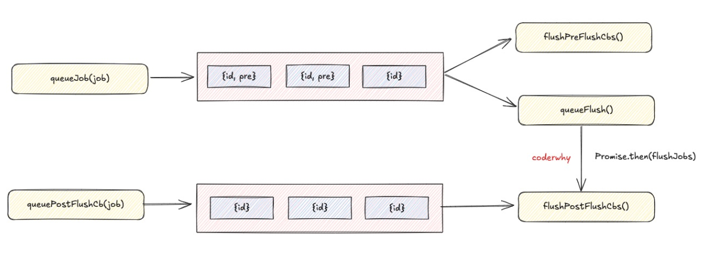

## Vue

### 1. Diff算法

每次发生更新时，都会生成的新的VDOM Tree和旧的VDOM Tree进行Diff，这个过程会进行逐层Diff

**每一层的Diff**

#### **1.1 有动态内容的结点（不需要对比结点顺序）进行Block Diff**

在生成VDOM Tree时，Vue会标记需要动态更新的结点，也就是有动态值的结点进行Diff，而那些静态内容的结点不会发生更新

**需要对比结点顺序**（v-for）

#### **1.2 无Key的Diff**

1. 取新旧节点数组较小长度为公共长度
2. 以公共长度为结尾进行循环，按序对比新旧节点
3. 循环结束，若旧节点数组仍有剩余，卸载对应节点，若新节点数组仍有剩余，挂载相应节点


#### **1.3 有key的Diff**

1. 从头部开始Diff，判断key和type均相同的为可复用结点，进行patch
2. 从尾部开始Difff，判断key和type均相同的为可复用结点，进行patch
3. 如果旧列表所有结点Diff结束，新列表仍有剩余结点，则挂载剩余结点

​	  eg: 原始序列 **a -> b -> c** 改变后的序列 **a -> b -> c -> d -> e**

4. 如果新列表所有结点Diff结束，旧列表仍有剩余结点，则卸载剩余结点

​      eg: 原始序列 **a -> b -> c -> d -> e** 改变后的序列 **a -> b -> c**

5. 首尾公共部分Diff结束，剩余中间部分进行Diff

​      eg: 原始序列 **a -> b -> c -> d -> e** 改变后的序列 **a -> c -> b -> e -> d** 

​			剩余Diff序列 old: **b -> c -> d -> e**    new: **c -> b -> e - > d**

​      5.1 生成新列表的key和index之间的Map **{ c:  1, b: 2,  e:3, d:4 }**

​      5.2 生成新旧列表结点的顺序索引，长度的新列表剩余Diff长度，即**4**

​		5.2.1 遍历旧列表，通过key从Map查找新索引

​		5.2.2 计算其顺序索引，即**[3, 2, 5, 4]**，值越小代表结点在原序列中顺序靠前，如果值为**0**，代表这个结点在原列表中未找到，在这个过程中patch对应结点进行更新，尽可能地复用原结点

```javascript
    // newIndex - s2 获取旧节点在新列表中的索引
    // i + 1描述旧结点的在新列表中的顺序索引 i为旧列表的遍历索引 i越小 代表原结点在旧列表中越靠前
    // 当newIndexToOldIndexMap中的序列成递增子序列时说明序列已经正确 不必再进行更新
    newIndexToOldIndexMap[newIndex - s2] = i + 1
```

​	  5.3 取顺序索引中的最长递增子序列，即**[1, 3]**（存的是索引)，对应顺序索引**[2, 4]**，结点**b -> d**，从尾部开始遍历，分为三种情况

​		5.3.1 若值为0则挂载

​		5.3.2 索引是最长递增子序列中的索引，跳过

​		5.3.3 索引不是最长递增子序列中的索引，找到在最长递增子序列中的插入位置，使其仍保持递增，例如**5 -> index 2**，找到在**[2, 4] -> index[1, 3]**中的插入位置，即**[2, 4, 5]**让其仍保持递增

​		5.3.4 遍历结束，整个序列成递增序列，即**[2, 3, 4, 5]**，此时顺序已经移动正确，将原来的结点都进行了复用并移动到相应位置，即 **c -> b -> e - > d**，Diff结束

### 2. 响应式原理

#### 2.1 reactive函数

首先第一步需要拦截数据的getter，setter，**reactive**函数通过Proxy来进行拦截，通过**effect**传入依赖触发**getter**拦截，在**getter**拦截中需要收集依赖，触发**track**创建依赖对应的数据结构（三个Map），通过**trackEffect**收集依赖。

在数据发生更新触发**setter**拦截，在**setter**拦截中触发**trigger**函数取出对应的数据结构，**trigger**函数会触发**triggerEffect**函数执行调度，触发所有依赖的更新（**run**方法）

1. **reactive**函数内部是通过**createReactiveObject**函数来创建一个响应式对象，核心就是创建**Proxy**对原始对象进行代理

2. **effect**函数收集依赖，首次执行（没有lazy）触发**getter**收集依赖，并初始化对应的**_effect**对象（**new ReactiveEffect**，内部传入调度器，调度器为**run**方法）

3. **getter**触发track函数收集依赖

4. **track**会获取或者创建相应的数据结构，对应1个WeakMap **targetMap**，2个Map **depsMap和dep**

​         **targetMap：**key为对象，value为key对应的Map **depsMap**，选择WeakMap的原因是WeakMap是弱引用，方便GC进行内存回收，防止内存泄漏

​         **depsMap：**key为对象的key值，value为**dep**

​         **dep：**key为依赖（副作用函数的effect对象），value为_trackId，目的是防止重复收集依赖

​         创建完成触发**trackEffect**函数将依赖进行收集，即将effec设置到dep中

5. obj[key]发生改变时，触发**setter**来触发**trigger**函数
6. **trigger**函数从对应的数据结构中取出依赖，targetMap => obj => depsMap => key => dep，取出依赖后暂停调度，依次通过**triggerEffect**函数通过所有依赖进行更新
7. **triggerEffect**会将依赖的调度器（调度器为传入的_effect.run方法）加入到调度队列，然后恢复调度，执行更新


#### 2.2 ref函数

**ref**函数内部  => **new RefImpl(value)** => 包装进**ref.value**，如果是对象，调用**reactive**获得proxy对象

**ref.value**收集依赖 => 触发 **RefImpl getter** => **ref.dep**存储对应的依赖，**Map（effect => _trackId）**=> 调用**trackEffect**收集依赖

修改**ref.value**触发更新 => 触发 **RefImpl setter** => 调用**trackEffects**，取出**ref.dep**，把**effect**加入调度队列进行调度更新

#### 2.3 computed函数

**computed(getter)** => **new ComputedRefImpl**  **_value**缓存

**computed**收集依赖，**effcet(fn2)** => **ComputedRefImpl getter value**，判断是否为脏值，为脏值，执行传递进来的**getter fn1**收集依赖，不为脏值，返回缓存**_value**  => 执行fn1，fn1内部依赖了a和b的value，进行**ref**收集依赖，将**effect1 fn1**和**trigger**（调度器为null）收集到对象的dep中，即 **a.dep = { effect1 => _ trackId }**，**b.dep = { effect1 => _ trackId }**  => 将fn2作为effect收集到**sum.dep**中，即**sum.dep = { fn2 => _ trackId }**，修改**sum.dirty = nodirty**，下次访问直接返回缓存**_value**，不执行**getter**

**computed**触发更新 => 依赖发生改变，触发**a setter value** => 触发**ref**更新，取出**a.dep**触发**computed** **trigge**r进行更新，执行**triggerRefValue(sum)** => 触发**triggerEffects**，取出**sum.dep**进行调度更新，=> 获取**sum.dep.effect.dirty**时，触发**triggerComputed**，访问**sum.value** => 触发**sum getter** ，由于值发生改变，此时为脏值，重新执行**sum.effect.run** ，即执行**computed**传递进来的**getter**函数，获取新值 =>  触发执行**effect fn2**，完成更新

```javascript
const a = ref(1)
const b = ref(2)
const fn1 = () => a.value + b.value
const sum = computed()
const fn2 = () => console.log(sum.value)
effect(fn2)
a.value = 2
```

#### **2.4 watch函数**

watch(source, cb, options) => dowatch(source, cb, options)

1. 把source包装成一个getter函数，getter = () => source.value
2. 创建调度器scheduler来调度cb，根据options.flush来确定调度时机
3. 为getter创建一个effect，effect = new ReactiveEffect(getter, NOOP, scheduler)，把effect收集到source中
4. 调用effect.run()获取旧值
5. 当source发生改变时，执行调度器scheduler，实际是执行job函数，在内部调用了cb，并再次调用effect.run()获取新值，将旧值和新值一起传递给cb

```javascript
const num = ref(0)
watch(num, () => console.log(num.value))
num.value = 1
```

#### **2.5 watchEffect函数**

watchEffect(effect, options) => dowatch(effect, null, options)

1. 把effect包裹成getter，getter = () => effect()，由于effect为函数，getter会去执行effect函数
2. 创建调度器scheduler来调度effect，根据options.flush来确定调度时机
3. 为getter创建一个effectGetter，effectGetter = new ReactiveEffect(getter, NOOP, scheduler)，把effectGetter收集到source（effect内部的数据源）中
4. 由于没有传cb参数，直接执行effectGetter.run()，相当于直接执行effect收集依赖
5. source发生改变时，执行执行调度器scheduler，实际是执行job函数，在内部重新调用了effectGetter.run()，相当于重新执行effect函数

### 3. 模板编译

1. 模板经过词法分析和语法分析得到AST，词法分析遍历每一个字符并进行标记（关键词，操作符，标识符等）类型，语法分析根据语法规则对词法分析得到的字符流建立AST

2. 遍历AST，为每个节点应用转换，得到新的AST

3. 根据新的AST，生成render函数，模板编译过程会进行静态提升，标记静态内容不进行更新，为后续render函数，Diff过程进行优化


### 4. 调度系统

分为两个队列来进行调度，达到三个队列的效果

第一个队列通过queueJob(job)来加入任务，job会进行去重，job可以有id和pre属性

1. 没有id，直接加入队列尾部
2. 有id，根据id进行二分查找加入队列

第二个队列通过queuePostFlushCb(job)来加入任务，也是根据id进行排序

所有队列的任务都是通过Promise.then加入微任务队列

1. 执行queueFlush(flushJobs)，即Promise.then(flushJobs)
2. flushJobs函数会对队列进行排序，排完序依次执行任务（可以通过flushPreFlushCbs来优先取出所有pre属性的任务先执行）
3. 最终再执行flushPostFlushCbs()清空Post队列

**watch**和**watchEffect**中的执行时机，**options.flush**

1. sync，scheduler = job，在effect触发调度scheduler同步执行
2. pre，scheduler = queueJob(job)，在effect触发调度scheduler时将任务加入队列，同时给job加上id和pre属性，因此优先于UI update
3. post，scheduler = queuePostFlushCb(job)，在effect触发调度scheduler时将任务加入Post队列，UI update之后执行

**Component update**：effect.sheduler = queueJob(update)，调度时机在微任务队列中，因此UI update是异步的

**nexttick：**nexttick(cb)，将cb放入promise.then(queueFlush(flushJobs)).then(cb)中，因此可以在刷新队列任务之后，重新加入微任务队列，达到在UI update之后重新执行



#### 5. KeepAlive

KeepAlive对应也是一个组件，在处理KeepAlive组件时

1. 执行KeepAlive的setup函数，返回一个render函数，render函数会去获取slot.defalut()，获取插槽内容，也就是缓存的子组件
2. 处理setup返回的结果，执行对应的render函数，将子组件编译为实际的render函数

缓存原理：用Map缓存，{key -> vnode}，key为组件的key，vnode为虚拟节点

max原理：内部维护一个Set来存储缓存的key，当缓存key大于max时，采用LRU（最近最少使用）算法（set.next().value）移除key

include，exclude：判断是否要缓存，根据组件的name来进行匹配，include则缓存，exclude不缓存

切换原理：内部创建一个storageContainer（对应一个div容器），当切换时将旧组件移到storageContainer，新组件移到实际的container


#### 6. 生命周期

**createComponentInstance** -> **setupComponent** -> **setupStatefulComponent**（执行setup函数）-> **handleSetupResult** -> **applyOptions**（处理选项式API，内部调用**beforeCreate**和**created**）-> **setupRenderEffect**（判断是挂载还是更新，挂载执行**beforeMount**和**mdounted**并在两个钩子之间编译模板，赋值给组件的**render**函数，更新执行**beforeUpdate**和**updated**）


