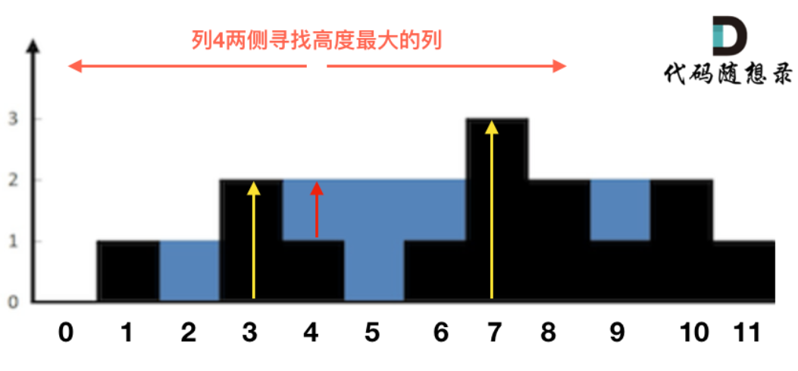

## 算法

#### 1. 前缀和

使用哈希表存储前缀和出现的次数，求路径和为k的路径总数

- 和为K的子数组

- 路径总和III

#### 2. 矩阵

模拟题，每条边的处理都按一样的原则进行处理（左闭右开）

- 螺旋矩阵II

n阶矩阵，注意中间最后的元素

- 螺旋矩阵

分三种情况处理

```javascript
// n阶方阵且n为奇数 处理最后的中心元素
if (m === n && n % 2 === 1) res.push(matrix[x][y])
// m > n 处理中间剩下的一条竖边
if (m > n) {
    // x <= m - offset && y === n - offset 中间仍剩下元素
    while (x <= m - offset && y === n - offset) {
      res.push(matrix[x++][y])
    }
}
// m < n 处理中间剩下的一条横边
if (m < n) {
    // x === m - offset && y <= n - offset 中间仍剩下元素
    while (y <= n - offset && x === m - offset) {
      res.push(matrix[x][y++])
    }
}
```

- 矩阵置零

  - 复制一遍矩阵，遍历矩阵，遇到0将对应的行列置为0，然后再更新到原数组上，O(mn)的空间复杂度
  - 用两个标记数组，对应行列，遍历矩阵，遇到0将对应的行列标记为true，然后再更新原数组，对应行或者列的标记为true则置0，O(m + n)的时间复杂度
  - 用矩阵的第一行和第一列来替代标记数组（很没必要的做法说实话，纯为了省空间增加复杂度）
    - 先预处理第一行和第一列，用两个标记变量标记是否含0
    - 遍历其他行和其他列，遇到0，标记对应的行和列为0，即修改第一行和第一列中的值为0
    - 遍历其他行和其他列，根据第一行和第一列是否为0，把其他行和列置0
    - 根据标记变量修改第一行和第一列


  ```typescript
  const m = martix.length
  const n = martix[0].length
  const flagRow = new Array(m).fill(false)
  const flagColumn = new Array(n).fill(false)
  
  for (let i = 0; i < m; i++) {
      for (let j = 0; j < n; j++) {
          if (martix[i][j] === 0) {
              flagRow[i] = true
              flagColumn[j] = true
          }
      }
  }
  
  for (let i = 0; i < m; i++) {
      for (let j = 0; j < n; j++) {
          if (flagRow[i] || flagColumn[j]) {
  			martix[i][j] = 0
          }
      }
  }
  ```

- 旋转图像

  - 交换对角线的元素, 再翻转每一行
  - 采用新矩阵存储旋转后的矩阵, 然后重写原矩阵

#### 3. 哈希表

- 两数之和

找到一个数组内和等于target的两个元素

暴力，需要遍历数组两遍 O(n^2)

哈希表优化，使用哈希表存储target - arr[i]，一次遍历即可找到结果

- 四数之和

找到四个数组和为target的四元组

暴力，O(n^4)

哈希表优化，使用哈希表存储两个数组元素的和，降低到O(n^2)

- **字母异位词分组**

对每个字符串按字典序重新排序，以此为key，value值为异位词数组

- **最长连续序列**

通过set存储数组中所有数，找到序列的起点，累计序列的长度

```typescript
function longestConsecutive(nums: number[]): number {
  const set = new Set<number>()
  nums.forEach((num) => set.add(num))

  let max = 0
  for (let i = 0; i < nums.length; i++) {
    // 前驱数存在 肯定不会以该数为开头
    if (set.has(nums[i] - 1)) continue
    let len = 1
    let next = 1
    // 累计序列长度
    while (set.has(nums[i] + next)) {
      len++
      next++
    }
    max = Math.max(max, len)
  }

  return max
}
```

#### 4. 双指针

**快慢指针**

- 移动零

**对撞指针**

- 三数之和
- 四数之和

同一个数组内多数和等于指定值

核心：排序之后使用双指针查找解，注意去重

```javascript
function threeSum(nums: number[]): number[][] {
    nums.sort((a, b) => a - b)
    let res: number[][] = []

    for (let i = 0; i < nums.length; i++) {
        if (nums[i] > 0) break
        if (i > 0 && nums[i] === nums[i - 1]) continue

        let left = i + 1
        let right = nums.length - 1
        
        while (left < right) {
            const sum = nums[i] + nums[left] + nums[right]
            if (sum > 0) right--
            if (sum < 0) left++
            if (sum === 0) {
                res.push([nums[i], nums[left], nums[right]])
                while (left < right && nums[left] === nums[left + 1]) left++
                while (left < right && nums[right] === nums[right - 1]) right--
                left++
                right--
            } 
        }
    }

    return res
};
```

- 盛最多水的容器

暴力：两次for循环，遍历以每条边为起点，另一条边为终点

核心：使两边尽可能地大，以及x轴的距离尽可能大

```typescript
function maxArea(height: number[]): number {
    let left = 0
    let right = height.length - 1
    let res = 0 

    while (left < right) {
        const area = (right - left) * Math.min(height[left], height[right])
        res = Math.max(res, area)
        // 每次移动会使长度变小，想要使面积变大，需要找到更高的边
        // 左边小，移动左边，右边小，移动右边
        if (height[left] < height[right]) left++
        else right--
    }

    return res
}
```

- 颜色分类
  - 左指针指向0的下一个插入位置，右指针指向2的下一个插入位置
  - 一次遍历，遇到0与左指针交换，遇到1直接跳过，遇到2与右指针交换，且需要重新检查该位置交换过来的元素


```typescript
function sortColors(nums: number[]): void {
    const n = nums.length
    let left = 0
    let right = n - 1

    const swap = (index1: number, index2: number) => {
        const temp = nums[index1]
        nums[index1] = nums[index2]
        nums[index2] = temp
    }

    let i = 0
    while (i <= right) {
        if (nums[i] === 0) {
            swap(left, i)
            i++
            left++
        } else if (nums[i] === 2) {
            swap(right, i)
            right--
        } else {
            i++
        }
    }
}
```

- 接雨水

  - 按照列进行计算，宽度为1，每一列接的雨水取决于左边最高的柱子和右边最高的柱子中较小的一个，高度差即为接的雨水，由于第一列左边和最后一列右边没有值，因此接不了雨水

  ```typescript
  // O(N ^ 2)
  function trap(height: number[]): number {
      let res = 0
  
      for (let i = 1; i < height.length - 1; i++) {
          let left = height[i - 1]
          for (let j = i - 2; j >= 0; j--) {
              left = Math.max(left, height[j])
          }
  
          let right = height[i + 1]
          for (let j = i + 2; j < height.length; j++) {
              right = Math.max(right, height[j])
          }
  
          const current = Math.min(left, right) - height[i]
          // 大于0才接了雨水，进行结果收集
          if (current > 0) res += current
      }
  
      return res
  }
  ```

  ```typescript
  // 空间换时间 降低到O(N)
  function trap(height: number[]): number {
      let res = 0
      const n = height.length
  
      const left = new Array(n).fill(0)
      left[0] = height[0]
      for (let i = 1; i < n - 1; i++) {
          left[i] = Math.max(left[i - 1], height[i - 1])
      }
  
      const right = new Array(n).fill(0)
      right[n - 1] = height[n - 1]
      for (let i = n - 2; i > 0; i--) {
          right[i] = Math.max(right[i + 1], height[i + 1])
      } 
      
      for (let i = 1; i < height.length - 1; i++) {
          const current = Math.min(left[i], right[i]) - height[i]
          if (current > 0) res += current
      }
  
      return res
  }
  ```

  

- 柱状图中最大的矩形，就是往左右找第一个小于其的柱子，寻找当前柱子可以横跨的最大面积，累计每个柱子的最大值即可
  
  ```javascript
  function largestRectangleArea(heights) {
      int sum = 0;
      for (let i = 0; i < heights.length; i++) {
          let left = i;
          let right = i;
          for (; left >= 0; left--) {
              if (heights[left] < heights[i]) break;
          }
          for (; right < heights.length; right++) {
              if (heights[right] < heights[i]) break;
          }
          const w = right - left - 1;
         	const h = heights[i];
          sum = max(sum, w * h);
      }
      return sum;
  }
  ```
  
  ```typescript
  function largestRectangleArea(heights: number[]): number {
      // 其实就是求每个柱子可以横跨的面积，所以只需要找到其左右第一个比其小的柱子，就能找出横跨的最大面积
      const n = heights.length
      // 初始化为-1, 默认左边可以横跨整个x轴
      // 空间换时间
      const leftMinIndex = new Array(n).fill(-1)
      for (let i = 1; i < n; i++) {
          let index = i - 1
          // 注意索引不要越界，往左寻找最小的柱子
          while (index >= 0 && heights[index] >= heights[i]) {
              index = leftMinIndex[index]
          }
          leftMinIndex[i] = index
      }
      // 初始化为n, 默认右边可以横跨整个x轴
      const rightMinIndex = new Array(n).fill(n)
      for (let i = n - 2; i >= 0; i--) {
          let index = i + 1
          while (index < n && heights[index] >= heights[i]) {
              index = rightMinIndex[index]
          }
          rightMinIndex[i] = index
      }
  
      let res = 0
      for (let i = 0; i < n; i++) {
          const width = rightMinIndex[i] - leftMinIndex[i] - 1
          const area = width * heights[i]
          res = Math.max(res, area)
      }
  
      return res
  }
  ```

**分离双指针**

- 相交链表

```typescript
const getIntersectionNode = function (
  headA: ListNode | null,
  headB: ListNode | null
): ListNode | null {
  if (!headA || !headB) return null

  let currA: ListNode | null = headA
  let currB: ListNode | null = headB

  // 相交部分长度为k listA长度为n listB长度为m
  // 不相交的部分为n - k 以及 m - k
  // 走到相交结点 (currA -> n + m - k) (currB -> m + n - k)
  // 不相交时 遍历完两个链表 同时走到null 不会死循环
  while (currA !== currB) {
    currA = currA === null ? headB : currA.next
    currB = currB === null ? headA : currB.next
  }

  return currA
}
```

#### 5. 滑动窗口

适合求解合适的子数组或者子串，一点点扩张和移动

**定长窗口**

- **找到字符串中所有字母异位词**

使用字符哈希存储字母计数，遍历字符串p和字符串s中每一个窗口

窗口中的字符会使计数加1，字符串p中的字符会使计数-1

遍历字符哈希，若全为0，说明窗口内的子串为p的异位词

另一种方法，对p和窗口内的子串都进行字典序排序，对比两个字符串是否相同即可，时间复杂度过高

```typescript
function findAnagrams(s: string, p: string): number[] {
  const res: number[] = []
  if (s.length < p.length) return res

  const map = new Array(26).fill(0)
  const aCode = "a".charCodeAt(0)
  // 预处理第一个窗口
  for (let i = 0; i < p.length; i++) {
    const index1 = p[i].charCodeAt(0) - aCode
    const index2 = s[i].charCodeAt(0) - aCode
    map[index1]--
    map[index2]++
  }

  let diff = 0
  for (const count of map) {
    if (count !== 0) diff++
  }
  if (diff === 0) res.push(0)

  let left = 0
  let right = p.length - 1

  while (right < s.length - 1) {
    const index1 = s[left].charCodeAt(0) - aCode
    const index2 = s[right + 1].charCodeAt(0) - aCode
    // 窗口移除和加入的是同一个字符
    if (index1 === index2) {
      left++
      right++
      if (diff === 0) res.push(left)
      continue
    }

    // 移除左边的字符
    // 移除之前count为0 两个字符串差异加1
    // 移除需要使count减1
    if (map[index1] === 0) diff++
    left++
    map[index1]--
    // 移除之后count为0 说明移除的字符不是p中有的字符
    // 两个字符串差异减1
    if (map[index1] === 0) diff--

    // 加入右边的字符
    // 加入之前count为0 两个字符串差异加1
    // 加入需要使count加1
    if (map[index2] === 0) diff++
    right++
    map[index2]++
    // 加入之后count为0 说明加入的字符是p中有的字符
    // 两个字符串差异减1
    if (map[index2] === 0) diff--

    if (diff === 0) res.push(left)
  }

  return res
}

/**
 * O(n * mlogm) 超时
 */
function findAnagramsV1(s: string, p: string): number[] {
  let left = 0
  let right = p.length - 1
  const res: number[] = []
  const sortStr = p.split("").sort().join("")

  while (right < s.length) {
    const str = s
      .slice(left, right + 1)
      .split("")
      .sort()
      .join("")
    if (str === sortStr) res.push(left)
    left++
    right++
  }

  return res
}
```

- 滑动窗口最大值，核心就是单调队列的实现
  - 采用单调递减队列，队首元素为最大值
    - 加入的元素如果大于队尾元素，不满足单调递减，需要不断元素出队
  - 初始化时，将第一个窗口的值加入队列，并获取队首元素作为第一个窗口的最大值
    - 移动窗口，将新元素加入队列
    - 移除旧元素，判断移除的是否为队首元素，如果不为队首元素则忽略，否则队首元素出队
    - 将队首元素，即窗口内最大值加入结果数组

```typescript
function maxSlidingWindow(nums: number[], k: number): number[] {
  class Queue {
    data: number[] = []

    pop(value: number) {
		this.data.shift()
    }

    push(value: number) {
      while (!this.isEmpty() && value > this.back()!) {
        // 保持队列单调递减 弹出队列中小于新加入元素的元素
        this.data.pop()
      }
      this.data.push(value)
    }

    back() {
      if (!this.isEmpty()) return this.data[this.data.length - 1]
    }

    front() {
      if (!this.isEmpty()) return this.data[0]
    }

    isEmpty() {
      return this.data.length === 0
    }
  }

  const decreaseQueue = new Queue()
  const res: number[] = []
  // 处理第一个窗口
  for (let i = 0; i < k; i++) {
    decreaseQueue.push(nums[i])
  }
  res.push(decreaseQueue.front()!)
  // 移动窗口
  for (let i = k; i < nums.length; i++) {
    const maxEl = decreaseQueue.front()
    // 移除前一个窗口的元素
    if (nums[i - k] === maxEl) {
        decreaseQueue.pop()
    }
    // 加入新窗口元素
    decreaseQueue.push(nums[i])
    // 取出最大值
    res.push(decreaseQueue.front()!)
  }

  return res
}
```

**不定长窗口**

- 无重复字符的最长子串

- 最小覆盖子串

  - 利用哈希表1存储t串字符出现的频率，利用哈希表2存储s串中窗口字符出现的频率
  - 向外扩展窗口，验证哈希表1和哈希表2，如果哈希表2中所有字符的频率大于等于哈希表1，则窗口内的子串满足条件，此时不断收缩窗口，直接不满足条件，此时得到窗口内满足条件的最小子串，并更新结果
  - 继续扩展窗口，直至到达末尾

  ```typescript
  function minWindow(s: string, t: string): string {
    // 存放t中字符出现的次数
    const map1 = new Map<string, number>()
    // 存放s窗口中包含t中出现的字符的次数
    const map2 = new Map<string, number>()
  
    // 初始化map1
    for (let i = 0; i < t.length; i++) {
      const count = map1.get(t[i]) ?? 0
      map1.set(t[i], count + 1)
    }
  
    // 检查两个哈希表
    const check = () => {
      for (const [key, value] of map1) {
        const count = map2.get(key)
        // 如果map2中没有对应的key，说明该窗口缺少该字符，不满足
        // 如果窗口中出现的频率小于t中出现的频率，不满足
        if (!count || count < value) {
          return false
        }
      }
      return true
    }
  
    // 窗口索引
    let left = 0
    let right = 0
    // 结果索引
    let len = Number.MAX_SAFE_INTEGER
    let resLeft = -1
    let resRight = -1
  
    while (right < s.length) {
      // 加入的字符为t中的字符，更新频率
      if (map1.has(s[right])) {
        const count = map2.get(s[right]) ?? 0
        map2.set(s[right], count + 1)
      }
      // 窗口内的字符满足条件
      while (check() && left <= right) {
        // 更新结果索引
        if (right - left + 1 < len) {
          len = right - left + 1
          resLeft = left
          resRight = right
        }
        // 移除左边元素，如果为t中出现的字符，频率减1
        if (map2.has(s[left])) {
          const count = map2.get(s[left])!
          map2.set(s[left], count - 1)
        }
        left++
      }
      right++
    }
    // 结果索引未更新，说明没找到满足的窗口
    return resLeft === -1 ? "" : s.slice(resLeft, resRight + 1)
  }
  ```

#### 6. 链表

- 链表没思路的做法，转成数组再用数组的方法，但应该不会让这么做

- 反转链表
  - 迭代
  - 递归
  - 栈
  - 头插法
  
- 快慢指针应用：查找中间结点，查找环

- 回文链表

  - 转成数组，双指针

  - 找到中间结点断开，反转后半部分，依次对比是否相同

    - 找中间的办法，使用快慢指针，慢指针每次走一步，快指针每次走两步
      - 长度为奇数，快指针到达链表尾部，慢指针即为中间结点
      - 长度为奇数，快指针到达链表尾部的前一个结点，慢指针即为中间结点

    ```typescript
    const middleNode = (head: ListNode): ListNode => {
        let slow = head
        let fast = head
    
        while (fast.next && fast.next.next) {
          slow = slow.next!
          fast = fast.next.next
        }
    
        return slow!
    }
    ```

- 环形链表
  - 检测是否有环
    
    - 哈希表存储，需要空间复杂度
    - 快慢指针，相遇与非空结点即有环
    
  - 检测环入口，快慢指针，到达相遇结点，双指针从头结点和相遇结点出发，再次相遇即为环入口
  
    - 2 * (x + y) = n(y + z) + x + y => x + y = n(y + z) => x = (n - 1)(y + z) + z
  
    - n = 1 => x = z，n > 1 => 指针在环中转了n圈之后相遇，相遇结点即为环入口
  
    - 寻找重复数，其实就是这道题的包装版本，以0为起始结点，nums[val]为下一个结点，如果有重复数，会形成有环的链表，使用该题解法即可找到入口，即为重复的数
  
      eg：1， 2， 3， 1 => 0 -> 1 -> 2 -> 3 -> 1 -> 2 -> 3 -> 1
  
  
  
- 合并两个有序链表，归并的思想

```typescript
const mergeTwoLists = (list1: ListNode | null, list2: ListNode | null) => {
    if (!list1 && !list2) return null
    if (!list1) return list2
    if (!list2) return list1
    const mergeList = new ListNode(-1)
    let curr = mergeList
    let curr1: ListNode | null = list1
    let curr2: ListNode | null = list2

    while (curr1 && curr2) {
      if (curr1.val <= curr2.val) {
        curr.next = curr1
        curr1 = curr1.next
      } else {
        curr.next = curr2
        curr2 = curr2.next
      }
      curr = curr.next
    }

    if (curr1) curr.next = curr1
    if (curr2) curr.next = curr2

    return mergeList.next
}
```

- 合并K个升序链表，两两归并即可，需要借助变量存储中间归并结果
  - 时间复杂度，假设每个链表长度为n，每次归并最多只需要最长链表的时间复杂度，则第一次归并时间为n，第二次为2n，...，第k次为(k - 1)n，整体时间复杂度为(1 + 2 + ... + k - 1)n = [(k - 1)(k) / 2]n，即O(k^2n)

```typescript
let mergeList: ListNode | null = null
for (let i = 0; i < lists.length; i++) {
	mergeList = mergeTwoLists(mergeList, lists[i])
}

return mergeList
```

- 链表归并排序
  - 找到中间结点断开
  - 递归划分链表
  - 两两归并链表

```javascript
const mergeSort = (node) => {
	const mid = middle(node)
	const left = node
	const right = mid.next
	mid.next = null
	const leftList = mergeSort(left)
	const rightList = mergeSort(right)
	return merge(leftList, rightList)
}

mergeSort(head)
```

- 随机链表的复制
  - 先遍历一遍，复制完整的链表并且缓存所有结点，key为node.val，value为node，node.val -> node
  - 再遍历一遍，复制random指针，从缓存里面取结点
- LRU缓存
  - 双向链表存储，使用双向链表是便于结点操作，增加头尾指针，记得增加首尾虚拟结点统一表头和表尾操作
    - 尾指针为最久未使用，溢出时移除结点
    - 头指针未最近使用，当访问某个元素时移到头部
    - 核心方法moveToHead，removeTail，put，get
  - 哈希表存储key -> node，用以快速查找node，O(1)
  - 哈希表node -> key，用以在缓存溢出时通过node快速找到key，删除对应的哈希表项


#### 7. 贪心

- 买卖股票的最佳时机

每一天在卖出时，选择之前价格最低的一天卖出（局部最优）

遍历完整个价格数组，可得到最终的最优解（全局最优）

#### 8. 技巧题

- 只出现一次的数字
  - 哈希表，需要O(n)的时间复杂度，不满足需求
  - 位运算，按位异或，一次遍历，出现两次的数字互相异或得0（使用交换律），最终结果为0与出现一次的数字异或，即为最终的结果
    - 任何数与0异或仍为其本身
    - 任何数与本身异或为0
    - 异或运算满足交换律和结合律

```typescript
function singleNumber(nums: number[]): number {
  let res = 0

  for (const num of nums) {
    res ^= num
  }

  return res
}
```

- 多数元素
  - 哈希表，时间复杂度O(n)
  - 投票法，选定候选的数字，初始为nums[0]，遇到相同的数票数加1，不相同的数票数减1，为0时更换候选的数字，一次遍历之后，最终的候选数字为最终结果（因为得到的票数大于n/2）

```typescript
function majorityElement(nums: number[]): number {
    let candicate = nums[0]
    let votes = 1

    for (let i = 1; i < nums.length; i++) {
        const num = nums[i]
        // 票数为0 更换候选人
        if (votes === 0) {
            candicate = num
        }
        if (num === candicate) {
            votes++
        } else {
            votes--

        }
    }

    return candicate
}
```

#### 9. 数组

数组题没思路时，可以考虑排序之后再进行求解

- 轮转数组，三次翻转或者两次翻转之后双指针移动
- **除自身以外的乘积**，前缀积，然后再从尾部累乘后面的元素，利用结果数组存储
  - 可以利用额外空间，直接存储左边和右边的乘积

```typescript
const answer = new Array(n).fill(1)
for (let i = 1; i < n; i++) {
    answer[i] *= nums[i - 1]
}

let right = 1
for (let i = n - 1; i >= 0; i--) {
    answer[i] *= right
    right *= nums[i]
}

return answer
```

- 合并区间，排序之后再合并
- **缺失的第一个正数**，利用原数组作为额外的空间，长度为n的数组缺失的第一个正数范围为[1, n + 1]
  - 预处理，将原数组中小于1的数处理为n + 1，让整个数组全为正数，且不影响结果
  - 打标记，对出现在[1, n]范围内的数num在num - 1的位置打上标记，改为负数
    - 由于打标记的过程中可能修改了原数，需要获取绝对值
    - 不需要重复打标记
  - 遍历数组，如果nums[i]不为负数，说明未打上标记，此时i + 1即为缺失的第一个正数
  - 如果都打上标记，则n + 1为缺失的第一个正数

```typescript
function firstMissingPositive(nums: number[]): number {
  const n = nums.length

  // 利用原数组打负号标记，需要把小于1的数处理为正数
  for (let i = 0; i < n; i++) {
    if (nums[i] < 1) {
      nums[i] = n + 1
    }
  }

  // 打标记，如果原数组出现了[1, n]范围内的数
  // 在n - 1的位置打上标记，添加负号
  for (let i = 0; i < n; i++) {
    // 由于nums[i]可能被打上标记，需要先转为正数
    const num = Math.abs(nums[i])
    if (num >= 1 && num <= n) {
      const index = nums[i] - 1
      // 如果已经打上标记，说明出现重复的数，不必重新打标记
      if (nums[index] > 0) {
        nums[index] = -nums[index] 
      }
    }
   }

  for (let i = 0; i < n; i++) {
    if (nums[i] > 0) {
      return i + 1
    }
  }

  return n + 1
}
```

#### 10. 动态规划

1. 确定dp数组的含义
2. 确定状态转移方程
3. 确定dp数组的初始化
4. 确定遍历顺序
5. 举例推导

#### 11. 二叉树

常用技巧，后序结合返回值（从底向上），前序结合参数进行传递（从上向底）

- 遍历方式

  - 前序遍历，迭代（借助栈），递归
  - 中序遍历，迭代（借助栈），递归
  - 后序遍历，迭代（借助栈），递归
  - 层序遍历，借助队列，迭代

- 求深度，层序，前序，后序遍历方式都可以

  - 层序，一层一层遍历，每遍历完一层，深度加1
  - 前序，把深度作为参数在递归中传递，每向下访问一层，深度加1，在叶子结点统计结果
  - 后序，把深度作为返回值返回，空结点深度为0，每回溯一层，深度加1，在回溯过程统计结果（左右子树的深度的最大值）

  ```typescript
  const queue = []
  queue.push(root)
  let res = 0
  
  while (queue.length) {
      const n = queue.length
      res++
      // 遍历每一层
      for (let i = 0; i < n; i++) {
          const node = queue.shift()
          if (node.left) queue.push(node.left)
          if (node.right) queue.push(node.right)
      }
  }
  
  return res
  ```

  ```typescript
  let res = 0
  function traverse(node, depth) {
  	if (!node) return
  	if (!node.left && !node.right) {
  		res = Math.max(res, depth)
  		return
  	}
  	traverse(node.left, depth + 1)
  	traverse(node.right, depth + 1)
  }
  ```

  ```typescript
  let res = 0
  function traverse(node) {
  	if (!node) return 0
      const leftDepth = traverse(node.left)
      const rightDepth = traverse(node.right)
      return Math.max(leftDepth, rightDepth) + 1
  }
  ```

- **求直径**，本质上是求深度，遍历每一个结点，其左右子树的深度之和即为该结点的直径

```typescript
let res = 0
function traverse(root) {
	if (!root) return 0
	const left = traverse(root.left)
	const right = traverse(root.right)
	res = Math.max(res, left + right)
	return Math.max(left, right) + 1
}
```

- **最大路径和**，求深度的套壳

```typescript
function maxPathSum(root: TreeNode | null): number {
    let res = Number.MIN_SAFE_INTEGER

    const getPathSum = (node: TreeNode | null) => {
        if (!node) return 0
    	
        // 核心就这个步骤，如果子树和小于0，则不考虑子树的路径和
        const leftSum = Math.max(getPathSum(node.left), 0)
        const rightSum = Math.max(getPathSum(node.right), 0)

        res = Math.max(leftSum + rightSum + node.val, res)
        
        return Math.max(leftSum, rightSum) + node.val
    }
    getPathSum(root)

    return res
}
```

- **对称二叉树**

  - 迭代：利用栈，将对称的结点依次加入栈，每次弹出一对结点进行对比，判断是否对称

  ```typescript
  const stack: (TreeNode | null)[] = []
  if (!root) return true
  stack.push(root.left)
  stack.push(root.right)
  
  while (stack.length) {
      const right = stack.pop()
      const left = stack.pop()
      // 两个结点均为空，跳出循环，避免死循环
      if (!left && !right) continue
      // 不对称的情况  
      if (!left && right) return false
      if (left && !right) return false
      if (left.val !== right.val) return false
      // 左左对右右  
      stack.push(left.left)
      stack.push(right.right)
      // 左右对右左
      stack.push(left.right)
      stack.push(right.left)
  }
  
  return true
  ```

  - 递归：递归对比对称的结点

  ```typescript
  const compare = (left: TreeNode | null, right: TreeNode | null) => {
      if (!left && !right) return true
      if (!left && right) return false
      if (left && !right) return false
      if (left.val !== right.val) return false
  	// 需要两种情况都满足，才对称
      return compare(left.left, right.right) && compare(left.right, right.left)
  }
  
  return compare(root.left, root.right)
  ```

- 二叉搜索树
  - 二叉搜索树适合使用中序遍历，因为中序遍历就可以得到一个递增或递减序列
  - 将有序数组转为平衡二叉树，本质就是找到中间结点进行划分，让左右子树均匀即可平衡，递归划分即可得到平衡二叉树
  - 验证二叉搜索树，中序遍历，保存上一个结点，只要不是升序就不满足条件

- 层序遍历
  - 二叉树的右视图，取每一层的最右结点即可

- **二叉树展开为链表**

  - 先序遍历，保存结点序列，再遍历结点序列修改right指针

  - 遍历整个序列，分两种情况处理

    - 结点左子树为空，则不需要修改
    - 结点左子树不为空，需要找到当前结点右子树先序遍历的前驱结点，将当前结点的右子树放置到前驱结点的右子树，以使展开后满足先序遍历

    ```typescript
    let curr = root
    
    while (curr) {
        if (curr.left) {
            const next = curr.left
            let rightPre = curr.right
            // 前驱结点为最右边的结点，满足中左右的遍历顺序
            while (rightPre.right) {
                rightPre = rightPre.right
            }
            curr.left = null
            rightPre.right = curr.right
            curr.right = next
        }
        // 处理下一个结点
        curr = curr.right
    }
    ```


- **从前序遍历和中序遍历序列构造二叉树**

  - 找到根节点，划分左右子树
  - 划分左右子树的先序遍历区间和中序遍历区间，递归处理左右子树

  ```typescript
  // 左开右闭
  const traverse = (preOrderBegin, preOrderEnd, inOrderBegin, inOrderEnd) => {
      // 序列为空时返回null
      if (preOrderBegin === preOrderEnd) return null
      const rootVal = preOrder[preOrderBegin]
      const root = new TreeNode(rootVal)
      
      let index = inOrderBegin
      while (index < inOrderEnd) {
          if (inorder[index] === rootVal) break
          index++
      }
      
      const leftInOrderBegin = inOrderBegin
      const leftInOrderEnd = index
      const rightInOrderBegin = index + 1
      const rightInOrderEnd = inOrderEnd
      
      const leftPreOrderBegin = preOrderBegin + 1
      // 获取左子树的长度
      const leftPreOrderEnd = leftPreOrderBegin + index - inOrderBegin
      const rightPreOrderBegin = leftPreOrderEnd
      const rightPreOrderEnd = preOrderEnd
      
      root.left = traverse(
          leftPreOrderBegin, leftPreOrderEnd, leftInOrderBegin, leftInOrderEnd
      )
      
      root.right = traverse(
          rightPreOrderBegin, rightPreOrderEnd, rightInOrderBegin, rightInOrderEnd
      )
      
      return root
  }
  
  const n = preorder.length
  return traverse(0, n, 0, n)
  ```

- **二叉树的最近公共祖先**

  - 后序遍历，通过返回值判断p，q是否位于自己的左右子树中

  ```typescript
  function lowestCommonAncestor(root: TreeNode | null, p: TreeNode | null, q: TreeNode | null): TreeNode | null {
  	if (root === p || root === q || root === null) {
          return root
      }
      const left = lowestCommonAncestor(root.left, p, q)
      const right = lowestCommonAncestore(root.right, p, q)
      
      // p，q分别存在左右子树中，此时root就是最近公共祖先，把root返回给上层结点
      if (left && right) return root
      // 四种情况
      // 1. p作为根节点，q在p的子树中，此时只有一边有返回值
      // 2. q作为根节点，p在q的子树中，此时只有一边有返回值
      // 3. 只找到p
      // 4. 只找到q
      // p，q存在右子树中或者只有一个存在右子树中，此时right就是最近公共祖先，把right返回给上层结点
      if (!left && right) return right
      // p，q存在左子树中或者只有一个存在左子树中，此时left就是最近公共祖先，把left返回给上层结点
      if (left && !right) return left
      // 都不存在p，q，不是最近公共祖先
      return null
  };
  ```

- **二叉树的最大路径和**

#### 12. 单调队列

- 滑动窗口最大值，基于单调递减队列，可求得每个窗口的最大值，核心在于单调队列的实现

#### 13. 二分查找

- 查找值，最简单的实现

- 查找插入位置，就是二分查找查找失败时（low > high），low指针对应的位置即为插入位置

- 搜索二维矩阵，每一行递增，下一行的首元素大于前一行的尾元素，其实就是一个递增的数组划分成多行

  - 定位到对应行，使用二分查找搜索，O(logn) + O(m)，O(m)的时间定位行，O(logn)的时间查找元素
  - 定位行的过程还可以使用二分查找优化

  ```typescript
  const m = matrix.length
  const n = matrix[0].length
  let left = 0
  let right = m - 1
  let target = -1
  
  while (left < right) {
  	const mid = Math.floor((left + right) / 2)
  	if (matrix[mid][0] > target) {
  		right = mid - 1
  	} else {
  		if (target[mid][n - 1] <= target) {
  			target = mid
  			break
  		}
  		left = mid + 1
  	}
  }
  
  if (target === -1) return false
  ```

- 搜索二维矩阵II，每一行每一列都递增

  - 使用行定位或者列定位，都可以，定位到target所在行列（首元素小于等于target，尾元素大于等于target，才为target可以搜索的行列），使用二分查找，O(nlogm) or O(mlogn)
  - 优化版，直接从每一行的尾元素出发，采用类二分查找，大于则列--，小于则不在该行，行++

  ```typescript
  const m = martix.length
  const n = martix[0].length
  const x = 0
  const y = n - 1
  
  while (x < m && y >= 0) {
      if (martix[x][y] === target) return true
      if (martix[x][y] > target) y--
      if (martix[x][y] < target) x++
  }
  
  return false
  ```

- 搜索旋转排序数组

  - 核心就是判断在哪一部分表中，左表还是右表（根据数组首尾元素来判断，旋转之后这两部分对应两个表的开始和结尾）

  ```typescript
    const n = nums.length;
    let left = 0;
    let right = n - 1;
  
    while (left <= right) {
      const mid = Math.floor((left + right) / 2);
      if (nums[mid] === target) return mid;
      else if (nums[mid] > target) {
        // 位于左子表 nums[0] <= target < nums[mid]
        if (nums[0] <= target) {
          right = mid - 1;
        } else {
          // 位于右子表，判断是否已到达右边的递增部分
          if (nums[n - 1] >= nums[mid]) {
            right = mid - 1;
          } else {
            left = mid + 1;
          }
        }
      } else {
        // 位于右子表 nums[mid] < target <= nums[n - 1]
        if (nums[n - 1] >= target) {
          left = mid + 1;
        } else {
          // 位于左子表，判断是否已到达左边的递增部分
          if (nums[0] <= nums[mid]) {
            left = mid + 1;
          } else {
            right = mid - 1;
          }
        }
      }
    }
  
    return -1;
  ```

- 搜索旋转数组中的最小值

```typescript
function findMin(nums: number[]): number {
    const n = nums.length
    // 如果是升序数组，直接返回，=考虑只有一个元素的情况
    if (nums[0] <= nums[n - 1]) return nums[0]
    let left = 0
    let right = n - 1
	
    while (left <= right) {
        const mid = Math.floor((left + right) / 2)
        // 旋转后的数组最小值满足nums[mid - 1] > nums[mid]
        if (nums[mid - 1] > nums[mid]) return nums[mid]
        // 旋转后的数组最小值一定存在右半部分，如果nums[0] <= nums[mid]，则需要继续往右边寻找
        if (nums[0] <= nums[mid]) left = mid + 1
        else right = mid - 1
    }

    return -1
}
```

- 数据流的中位数
  - 使用二分查找查找插入位置 O(logn) + O(n)
  - 双指针找到中位数 O(n)[]()

```typescript
class MedianFinder {
    data: number[]
    
    constructor() {
        this.data = []
    }

    binarySearch(target) {
        let left = 0
        let right = this.data.length - 1

        while (left <= right) {
            const mid = Math.floor((left + right) / 2)
            const num = this.data[mid]
            if (num === target) {
                return mid
            } else if (num > target) {
                right = mid - 1
            } else {
                left = mid + 1
            }
        }

        return left
    }

    addNum(num: number): void {
        const insertIndex = this.binarySearch(num)
        this.data.splice(insertIndex, 0, num)
    }

    findMedian(): number {
        let left = 0
        let right = this.data.length - 1

        while (left < right) {
            left++
            right--
        }

        if (left === right) return this.data[left]
        
        return (this.data[left] + this.data[right]) / 2
    }
}
```

#### 14. 单调栈

- 每日温度，找到右边第一个大的元素
- 接雨水
- 柱状图中最大的矩形

#### 15. 回溯

- 组合问题，不强调顺序，{1， 2}，{2，1}是一个排列，回溯过程需要startIndex标记开始位置

  - 常用剪枝手段，排序，判断是否满足
  - 组合
  - 组合总和
  - 电话号码的字母组合

  ```typescript
  function combine(n: number, k: number): number[][] {
    const res: number[][] = []
    let subset: number[] = []
  
    function backtracking(index: number) {
      if (subset.length === k) {
        res.push([...subset])
        return
      }
  
      for (let i = index; i <= n; i++) {
        // 剩余元素不满足 直接return
        // k - subset.length 还需要收集的元素个数
        if (i > n - (k - subset.length) + 1) return
        subset.push(i)
        backtracking(i + 1)
        subset.pop()
      }
    }
  
    backtracking(1)
  
    return res
  }
  ```

- 排列问题，强调顺序，{1， 2}，{2，1}是两个排列，回溯过程需要used数组标记哪个元素已使用

  - 全排列

  ```typescript
  function permute(nums: number[]): number[][] {
    const res: number[][] = []
    if (!nums.length) return res
    const used: boolean[] = new Array(nums.length).fill(false)
    const subset: number[] = []
  
    const backtracking = () => {
      if (subset.length === nums.length) {
        res.push([...subset])
        return
      }
  
      for (let i = 0; i < nums.length; i++) {
        if (used[i]) continue
        used[i] = true
        subset.push(nums[i])
        backtracking()
        used[i] = false
        subset.pop()
      }
    }
  
    backtracking()
  
    return res
  }
  ```

- 切割问题

  - 分割回文串，类似组合问题，需要有起始索引startIndex

  ```typescript
  function partition(s: string): string[][] {
    const res: string[][] = []
    const subset: string[] = []
    
    const isPalindrome = (str: string): boolean => {
      if (!str.length) return false
  
      let left = 0
      let right = str.length - 1
      while (left < right) {
        if (str[left] !== str[right]) return false
        left++
        right--
      }
  
      return true
    }
  
    const backtracking = (index: number) => {
      if (index === s.length) {
        res.push([...subset])
        return
      }
  
      for (let i = index; i < s.length; i++) {
        const str = s.slice(index, i + 1)
        if (!isPalindrome(str)) continue
        subset.push(str)
        backtracking(i + 1)
        subset.pop()
      }
    }
  
    backtracking(0)
    
    return res
  };
  ```

  - 括号生成，回溯过程中需要严格保证左括号的数量大于等于右括号

  ```typescript
  function generateParenthesis(n: number): string[] {
      let left = 0
      let right = 0
      let res = []
      let str = ""
  
      const backtracking = () => {
          if (left === n && right === n) {
              res.push(str)
              return
          }
  
          if (left < n) {
              left++
              str += "("
              backtracking()
              str = str.slice(0, str.length - 1)
              left--
          }
          if (right < left) {
              right++
              str += ")"
              backtracking()
              str = str.slice(0, str.length - 1)
              right--
          }
      }
  
      backtracking()
  
      return res
  }
  ```

  
