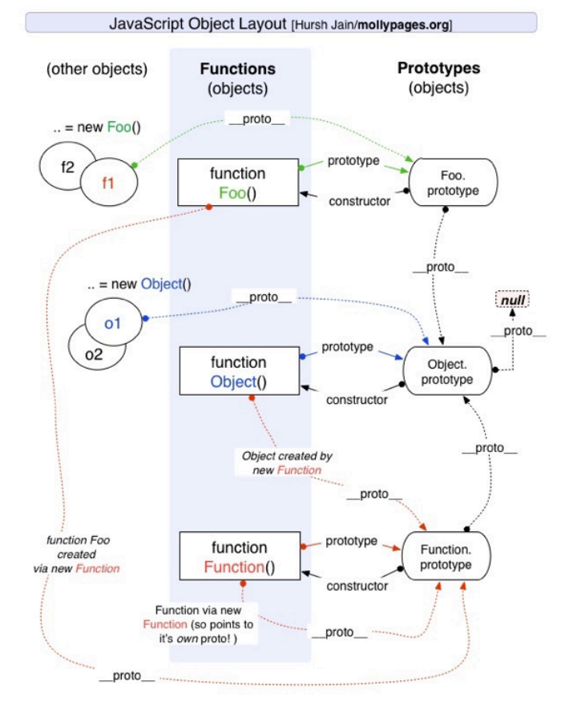

## JavaScript

#### 1. 箭头函数

- 没有this，super，prototype，arguments，this绑定上层作用域
- 不能用作构造函数，不能通过new调用
- 不能用作生成器函数，不能调用yield关键字
- 不能通过call，apply，bind绑定this

#### 2. new调用

1）创建以构造函数原型为原型的对象，将该对象的[[prototype]]属性绑定为函数的prototype

```javascript
const obj = Object.create(constructor.prototype)
```

2）设置对象为构造函数的this

```javascript
constructor = constructor.bind(obj)
```

3）执行构造函数

```javascript
const res = constructor()
```

4）如果构造函数没有返回值或者返回值不是对象，返回创建的对象

```javascript
const isObj = res && (typeof res === "object" || typeof res === "function")
return isObj ? res : obj
```

#### 3. 原型和原型链

原型和原型链的作用就是实现继承。结合new调用的过程回答

JS中每个对象都一个[[prototype]]属性，用以指向原型对象，当访问对象中的属性时，若该对象中没该属性就沿着原型链去查找。

原型链的终点是null，顶层原型是Object.prototype

原型链：Object.[[prototype]] = Function.prototype Function.prototype.[[prototype]] = Object.prototype

Object.prototype.[[prototype]] = null



#### 4. 继承

利用原型链实现继承，ES6 Class本质上也是语法糖，实际实现仍借助原型链

1. 创建以父类原型为原型的对象，赋值给子类原型
2. 定义创建的对象的构造器为子类
3. 借用父类构造函数初始化属性

属性放在对象本身上，方法放在原型上共享，节省内存

```javascript
function inheritPrototype(SubType, SuperType) {
  SubType.prototype = Object.create(SuperType.prototype)

  Object.defineProperty(SubType.prototype, 'constructor', {
    enumerable: false,
    configurable: true,
    writable: true, 
    value: SubType
  })
}


function Person(name, age, friends) {
  this.name = name
  this.age = age
  this.friends = friends
}

Person.prototype = {
  eating() {
    console.log(this.name + 'eating')
  },
  running() {
    console.log(this.name + 'running')
  }
}

Object.defineProperty(Person.prototype, 'constructor', {
  enumerable: false,
  configurable: true,
  writable: true, 
  value: Person
})

function Student(name, age, sno) {
  Person.call(this, name, age)
  this.sno = sno
}

inheritPrototype(Student, Person)

Student.prototype.studying = function() {
  console.log('studying')
}
```

#### 5. this指针

this是运行时绑定的，绑定规则与调用方式和调用位置有关

1. 默认绑定，当函数被独立调用时，在严格模式下this被绑定为全局对象（window或global），在非严格模式下被绑定为undefined
2. 隐式绑定，当通过对象.fun()调用时，即作为方法调用时，this被绑定为调用的对象
3. 显式绑定，通过call，apply，bind绑定this
4. new绑定，通过new调用时，this绑定为创建的对象

优先级 new绑定 > 显示绑定 > 隐式绑定 > 默认绑定

#### 6. var，let和const

var是JS设计之初的缺陷，let和const是完善方案，任何一门技术都是从0开始逐渐完善

- var定义的变量会被提升并初始化为undefined，let和const声明的变量不会被提升（实际上也会被提升但不会初始化）
- var定义的变量可以在声明前访问，let和const不行（暂时性死区，直至声明前不能访问）
- var声明的变量可以重复声明，let和const不行
- var定义的变量没有块级作用域，let和const有块级作用域

```javascript
// 由于var声明的变量没有块级作用域，等到onclick触发时，每个i都是5，可以利用let解决
for (var i = 0; i < 5; i++) {
    btn[i].onclick = function() {
        console.log(i)
    }
}
```

#### 7. Proxy和Reflect

Proxy是进行数据代理的对象，通过拦截原始对象的操作进行代理

- Proxy结合Reflect使用（recevier参数，拦截原始对象内部的this指针）可以拦截原始对象的所有操作，Object.defineProperty不能拦截新增和删除属性的操作，Vue2使用冗余的API拦截，Vue3使用Proxy重写响应式系统，移除冗余API
- Proxy新增加了代理层，Object.defineProperty通过修改属性描述符来进行拦截，Proxy会引入额外的性能消耗，Object.defineProperty适合简单的场景

#### 8. Map和WeakMap

直接结合Vue3的响应式原理进行描述

#### 9. 异步编程

1. 回调函数，通过在回调函数获取异步结果，容易形成回调地狱，可读性差，难以维护。
2. Promise，ES6提出的异步解决方案，通过维护等待，完成，拒绝三种状态，当调用resolve时，状态变成完成并执行then，当调用reject时状态变为拒绝并执行catch。通过then链式调用的方案来获取异步结果，实际上还是基于回调，（收集then传入的回调，调用resolve时执行回调）只不过以一种更优雅的编码方式来实现异步编程。
3. Generator，生成器，可以控制函数的执行流程，等待异步结果之后执行next

```javascript
function fetchData(url) {
 return new Promise((resolve, reject) => {
   setTimeout(() => {
     resolve(`${url} data `)
   }, 2000);
 })
}
function* getData() {
 const data1 = yield fetchData("aaa")
 console.log(data1)
 const data2 = yield fetchData(data1 + " bbb")
 console.log(data2)
 const data3 = yield fetchData(data2 + " ccc")
 console.log(data3)
}
const gen = getData()
gen.next().value.then(res1 => {
 gen.next(res1).value.then(res2 => {
   gen.next(res2).value.then(res3 => {
 	gen.next(res3)
   })
 })
})
```

4. async, await

async, await其实就是生成器和Promise的结合，以同步的代码来编写异步代码，更加优雅

#### 10. 可迭代协议，迭代器协议

可迭代协议：实现[Symbol.iterator]

迭代器协议：返回next函数，返回值是{value: xxx, done: true/false}

```javascript
const iteratorObj = {
  names: ['abc', 'cba', 'nba'],
  [Symbol.iterator]() {
    let index = 0
    let _this = this
    return {
      next() {
        if (index < _this.names.length) {
          return { done: false, value: _this.names[index++]}
        } else {
          return { done: true, value: undefined }
        }
      }
    }
  }
}
```

#### 11. ESM

1. 构建阶段

   1.1 根据URL下载main.js/index.js文件，进行**静态分析**(解析对应的import和export语句)，**解析成Module Recored**（模块记录），模块记录有一个RequestedModules属性，记录着引用的模块

   1.2 根据URL下载引用的模块，重复之前的操作

   1.3 下载模块时，**浏览器会维护一个Map**，记录URL与对应的模块记录（下载中也会记录下载中的状态），当遇到不同模块引用同一模块时，仅在第一次去下载对应的js文件，**第二次开始使用缓存**

   1.4 静态分析，即不会执行代码模块导入需在脚本顶层，**不会动态导入**

   ```javascript
   if (isModule) {
       import ... from ... // 不会生效
   }
   ```

   1.5 **模块代码仅在第一次导入执行，多次导入只会执行一次**

2. 实例化阶段

   2.1 将对应的Module Record（Module Record有一个LocalExport记录着导出的对象等，有一个ImportEntries记录着引用的对象等）实例化成Module Environment Recored

   2.2 Module Environment Recored有一个Bindings记录着绑定的属性

   2.3 **模块导出的属性在内存开辟一块空间保存着对应的属性**

   2.4 将对应的属性赋值为undefined

3. 求值阶段

   3.1 **运行模块中的代码，给导出的属性赋值**

   3.2 模块可以修改导出的对应的属性，模块无法修改导入模块的属性
