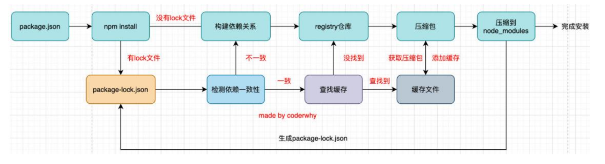

## 包管理工具

#### 1. npm install流程

#### 2. pnpm的优势

**硬链接：**指向同一个文件的索引结点

**软链接：**也是一个文件，文件里面存储的内容是实际文件的路径

1. 使用共享仓库存储所有依赖，项目目录node_modules中存储的是软链接，存储仓库文件中的路径，本地只存储一次依赖包，可以避免重复下载，因此安装速度更快，使用的磁盘空间更少。（版本号不同的依赖会各存储一份，可以与npm缓存一起说）

2. 创建非扁平的node_modules，npm安装之后的node_modules会将所有依赖提升到平级，比如npm install vue，但vue依赖了其他的包，会一起安装到node_modules下，造成的结果就是在项目中可以使用vue依赖的包，而pnpm的node_modules只会存储安装的vue，vue所依赖的包会放到vue的包中进行管理