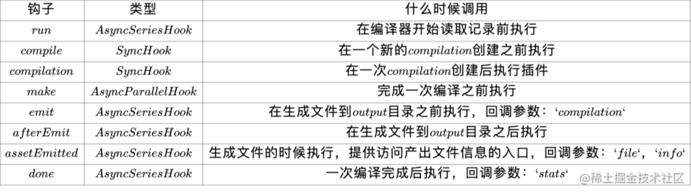

## Webpack

#### 1. 打包CSS，less

loader加载顺序为从右到左

1.1 style-loader将css注入DOM

1.2 css-loader处理css文件

1.3 less-loader处理less文件，转换为css文件，传递给css-loader

1.4 postcss-loader将一些现代的CSS特性，转成大多数浏览器认识的CSS，并且会根据目标浏览器或者运行时环境添加所需的polyfill，自动帮助我们添加autoprefixer

```javascript
{
    test: /\.css$/,
    use: [ "style-loader", "css-loader", "postcss-loader" ]
},
{
    test: /\.less$/,
    use: [ "style-loader", "css-loader", "less-loader", "postcss-loader" ]
},
```

#### 2. 打包图片

asset模块，配置较小的图片转为base64（减少请求数，当图片过大时base64过大，反而影响加载速度），较大的图片存为文件

responsive-loader：根据不同的视口大小生成多种尺寸的图像，适合响应式设计。支持自动生成适合不同屏幕的图片格式。

```javascript
{
    test: /\.(png|jpe?g|svg|gif)$/,
    type: "asset",
    parser: {
      dataUrlCondition: {
        maxSize: 60 * 1024
      }
    },
    generator: {
      filename: "img/[name]_[hash:8][ext]"
    }
}
```

#### 3. babel

js，ts，jsx，tsx均可以通过babel转换，添加pollyfill（core-js）

babel编译原理，通过babel-loader处理js文件，可通过加载预设配置预设好的插件

1. 词法分析解析字符并标记，语法分析生成AST
2. 遍历AST，对节点应用插件
3. 生成新AST
4. 生成新代码

#### 4. vue文件

vue模板依赖vue的编译器解析生成js代码，之后通过vue-loader加载

#### 5. 常见插件

- **CleanWebpackPlugin**每次打包清除之前的打包结果
- **HtmlWebpackPlugin**创建一个index.html，可以自定义EJS模板
- **DefinePlugin**配置编译全局常量
- **MiniCssExtractPlugin**将CSS代码提取成单独的文件
- **CSSMinimizerPlugin**压缩CSS代码
- **TerserPlugin**压缩代码
- **PurgeCSSPlugin**对CSS代码进行Tree Shaking
- **BundleAnalyzerPlugin**可视化分析代码打包体积

#### 6. 开发服务器devServer

- **HMR热模块替换**，开发模式下，webpack把打包结果存储在内存中，代码发生变化时，只替换变化的文件

- **proxy**：配置前端代理，解决跨域

- **historyApiFallback**：配置前端history模式路由刷新页面404的问题，与nginx配置类似，匹配不到路径时尝试返回index.html，然后交由前端路由控制

#### 7. source map作用

可以指定让webpack在打包时生成源文件映射，方便调试定位的源文件的代码处

1. 生成map文件
2. 在打包的文件加入map文件注释
3. 浏览器读取注释，映射到源文件

最佳实践：开发测试阶段使用source-map，生产环境不使用，减少代码传输体积

#### 8. 打包后的公共资源（部署）路径

- webpack

```javascript
output: {
	// 默认是/ 从项目的根目录下加载
	publicPath: cdn_url || / || /my_app
}
```

- vite

```javascript
// 会影响import.meta.env.BASE_URL
base: /
```

## vite和webpack的区别

- vite基于原生ESM，由浏览器来加载模块
- vite开发时不打包，按需加载，由esbuild编译成浏览器支持的代码，esbuild使用Go语言编写，构建速度很快，在浏览器请求源代码文件进行转发，获取编译好的文件执行，因此启动速度很快
- vite开发构建使用esbuild，打包使用rollup
- vite使用http缓存来优化加载速度，依赖的源码文件（不会经常发生更改）采用强缓存，项目的源码文件采用协商缓存
- webpack基于内存打包，将整个项目打包后存储在内存，随着项目的增长，启动速度很慢，但webpack生态较好，支持很多优化插件

## Webpack打包流程

+ 初始化阶段
  - 读取与合并配置
  - 实例化Compiler对象，遍历并调用插件的apply方法（接收compiler对象）注册插件，实际就是监听webpack构建过程中的事件
  - 执行compiler.run()开始编译

```javascript
const webpack = require("../lib/webpack");
const config = require("./webpack.config");

// 1.创建一个对象: compiler
// 另外一个非常重要的对象: compilation
const compiler = webpack(config);

// 2.执行run方法, 开始对代码进行编译和打包
compiler.run((err, stats) => {
	if (err) {
		console.error(err);
	} else {
		console.log(stats);
	}
});
```

+ 编译阶段
  - 根据配置中的entry找到所有入口文件
  - 分析模块依赖，调用Loader对模块进行转换
  - 递归构建依赖图谱
+ 生成阶段
  - 把编译后的代码组合成Chunk，转换成文件输出到文件系统

## 核心概念

- **compiler**是编译器对象，webpack启动一直存在
- **compilation**时一次编译的结果，文件更改触发重新编译之后会生成新的compilation对象，compiler对象不会更改，一直存在
- **module**对应一个资源模块，即一个文件
- **chunk**对应打包之后的代码块，即根据module之间的依赖关系生成的代码
- **bundle**对应最后的打包结果，对chunk经过一系列处理之后的文件

## Loader和Plugin的区别

Loader是Webpack用来处理对应模块文件的工具，例如css-loader用以处理css文件，babel-loader用以处理技js文件进行代码转换等。本质是一个函数，接收编译结果，进一步处理文件结果并返回，链式调用。

```javascript
const babel = require('@babel/core')

module.exports = function(content) {
  // 1.使用异步loader
  const callback = this.async()

  // 2.获取options
  let options = this.getOptions()
  if (!Object.keys(options).length) {
    options = require('../babel.config')
  }

  // 使用Babel转换代码
  babel.transform(content, options, (err, result) => {
    if (err) {
      callback(err)
    } else {
      callback(null, result.code)
    }
  })

  // return content
}
```

Plugin是用以扩展Webpack功能的工具，Plugin可以在Webpack的整个流程中扩展对应的功能。本质是一个函数或者类，需要在原型上有apply方法，监听对应的事件，在对应的事件触发时执行回调。

- plugin的执行顺序默认为注册的顺序，也就是我们传入的数组顺序，如果插件内部有stage（数值越小，执行越早）或者before，after选项（控制插件的先后执行顺序），会根据stage和before，after进行排序
- 调用tap实际上就是把回调注册到对应队列上，并根据stage或者和before，after进行排序，来确保插件的先后执行顺序

- 在compiler对象的钩子上注册事件
- 接收compilation对象操作内部实例数据
- 回调callback

```javascript
apply(compiler) {
    // console.log("AutoUploadWebpackPlugin被注册:")
    // 注册hooks监听事件
    // 等到assets已经输出到output目录上时, 完成自动上传的功能
    compiler.hooks.afterEmit.tapAsync("AutoPlugin", async (compilation, callback) => {
      // 1.获取输出文件夹路径(其中资源)
      const outputPath = compilation.outputOptions.path

      // 2.连接远程服务器 SSH
      await this.connectServer()

      // 3.删除原有的文件夹中内容
      const remotePath = this.options.remotePath
      this.ssh.execCommand(`rm -rf ${remotePath}/*`)

      // 4.将文件夹中资源上传到服务器中
      await this.uploadFiles(outputPath, remotePath)

      // 5.关闭ssh连接
      this.ssh.dispose()

      // 完成所有的操作后, 调用callback()
      callback()
    })
}
```



## HMR原理

- dev-server建立和浏览器的websocket连接
- 当文件发生变化时触发重新更新，生成新的编译结果和文件哈希值
- dev-server推送消息给浏览器
- 浏览器对比新旧文件哈希，发现不一致，重新请求新的资源
- vite的HMR原理是利用协商缓存

## Tree Shaking原理

- 利用ESM的静态分析特性，编译时就确定模块的依赖关系，识别出哪些代码是未使用的
- 构建过程中，标记未使用的代码，在最终打包时结合Terser进行压缩和优化
