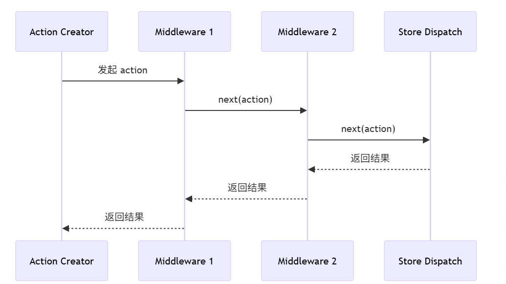

## 状态管理

#### 1. redux

**1.1 核心概念**

- store，存放全局状态的地方，统一管理状态
- action，对应一个JS对象，描述更新的type和content，通过dispacth来派发，让状态更改可追踪
- reducer，对应一个纯函数，将传入的state和action进行结合，返回值作为新的state

**1.2 redux使用**

1. 定义state和reducer

```javascript
import * as actionTypes from "./constants"

const initialState = {
  counter: 100,
  
  banners: [],
  recommends: []
}

function reducer(state = initialState, action) {
  switch (action.type) {
    case actionTypes.ADD_NUMBER:
      return { ...state, counter: state.counter + action.num }
    case actionTypes.SUB_NUMBER:
      return { ...state, counter: state.counter - action.num }
    case actionTypes.CHANGE_BANNERS:
      return { ...state, banners: action.banners }
    case actionTypes.CHANGE_RECOMMENDS:
      return { ...state, recommends: action.recommends }
    default:
      return state
  }
}

export default reducer
```

2. 创建actionCreators

```javascript
import * as actionTypes from "./constants"

export const addNumberAction = (num) => ({
  type: actionTypes.ADD_NUMBER,
  num
})

export const subNumberAction = (num) => ({
  type: actionTypes.SUB_NUMBER,
  num
})


export const changeBannersAction = (banners) => ({
  type: actionTypes.CHANGE_BANNERS,
  banners
})

export const changeRecommendsAction = (recommends) => ({
  type: actionTypes.CHANGE_RECOMMENDS,
  recommends
})
```

3. 创建action类型常量

```javascript
export const ADD_NUMBER = "add_number"
export const SUB_NUMBER = "sub_number"

export const CHANGE_BANNERS = "change_banners"
export const CHANGE_RECOMMENDS = "change_recommends"
```

4. 创建store

```javascript
import { createStore } from "redux"
import reducer from "./reducer"

const store = createStore(reducer)

export default store
```

5. 订阅state，派发action

```javascript
const unsubscribe = store.subscribe(() => {
  console.log("订阅数据的变化:", store.getState())
})
// redux默认dispatch只接受一个对象 {type, payload}
// 使用actionCreator统一创建action
store.dispatch(changeNameAction("kobe"))
store.dispatch(changeNameAction("lilei"))
store.dispatch(changeNameAction("james"))
```

**1.3 reudx-thunk派发异步action**

1. 使用中间件，组合函数

```javascript
import { createStore, applyMiddleware, compose } from "redux"
import thunk from "redux-thunk"
import reducer from "./reducer"

// 正常情况下 store.dispatch(object)
// 想要派发函数 store.dispatch(function)

// redux-devtools
const composeEnhancers = window.__REDUX_DEVTOOLS_EXTENSION_COMPOSE__({trace: true}) || compose;
const store = createStore(reducer, composeEnhancers(applyMiddleware(thunk)))

export default store
```

2. 函数柯里化的形式创建异步action，接收distpacth和getState

```javascript
export const fetchHomeMultidataAction = () => {
  // 如果是一个普通的action, 那么我们这里需要返回action对象
  // 问题: 对象中是不能直接拿到从服务器请求的异步数据的
  // return {}

  return function(dispatch, getState) {
    // 异步操作: 网络请求
    // console.log("foo function execution-----", getState().counter)
    axios.get("http://123.207.32.32:8000/home/multidata").then(res => {
      const banners = res.data.data.banner.list
      const recommends = res.data.data.recommend.list

      // dispatch({ type: actionTypes.CHANGE_BANNERS, banners })
      // dispatch({ type: actionTypes.CHANGE_RECOMMENDS, recommends })
      dispatch(changeBannersAction(banners))
      dispatch(changeRecommendsAction(recommends))
    })
  }

  // 如果返回的是一个函数, 那么redux是不支持的
  // return foo
}
```

3. redux-thunk中间件的原理，对store.dispatch打补丁，做功能增强，原始dispatch函数只接受一个action对象，使用thunk中间件重写dispatch函数进行拦截，并在内部调用原始的dispatch
   - redux-thunk数据流 
   - action -> thunkMiddleware -> asyncAction -> newAction -> reducer

```javascript
function thunk(store) {
  const next = store.dispatch
  function dispatchThunk(action) {
    if (typeof action === "function") {
      action(store.dispatch, store.getState)
    } else {
      next(action)
    }
  }
  store.dispatch = dispatchThunk
}
```

4. applyMiddleware的原理

   - 把store中的getState，dispatch注入中间件
   - 把所有的中间件通过组合函数组合成函数调用链，eg：middleware1(middleware2(middleware3()))
   - 把原始的disptach函数作为next函数注入到最后一个中间件
   - 重写dispatch函数，拦截action进入中间件进行处理
   - 中间件的执行流程采用洋葱模型，从外到内再从内到外

   

```javascript
// Redux 中间件的简化实现
function applyMiddleware(...middlewares) {
  return createStore => (...args) => {
    const store = createStore(...args)
    let dispatch = store.dispatch
    
    const middlewareAPI = {
      getState: store.getState,
      dispatch: action => dispatch(action)
    }
    
    // 给每个中间件传入 store 参数
    const chain = middlewares.map(middleware => middleware(middlewareAPI))
    
    // 组合所有中间件
    dispatch = compose(...chain)(store.dispatch)
    
    return {
      ...store,
      dispatch
    }
  }
}

// compose 函数的实现
function compose(...funcs) {
  if (funcs.length === 0) return arg => arg
  if (funcs.length === 1) return funcs[0]
  return funcs.reduce((a, b) => (...args) => a(b(...args)))
}
```

5. 自定义中间件，采用函数柯里化的方式，store => next => action => {}, 每一个中间件最后一层返回的函数action => {}会作为next函数注入到上一个中间件中，与上述redux-thunk原理一致，相等于下一个中间件重写的dispatch函数注入到前一个中间件中

```javascript
// 日志中间件
const logger = store => next => action => {
  console.log('dispatching:', action)
  const result = next(action)
  console.log('next state:', store.getState())
  return result
}

// 异步处理中间件
const thunk = store => next => action => {
  if (typeof action === 'function') {
    return action(store.dispatch, store.getState)
  }
  return next(action)
}

// 使用中间件
const store = createStore(
  reducer,
  applyMiddleware(thunk, logger)
)
```

**1.4 分模块使用**

```javascript
// 将两个reducer合并在一起，将多个reducer合并返回一个新的函数，作为合并之后的reducer
const reducer = combineReducers({
  counter: counterReducer,
  home: homeReducer,
  user: userReducer
})
```

**1.5 redux-saga派发异步action**

1. 创建saga
   - effects
     - call执行异步函数
     - put派发action
     - select获取state
     - takeEvery监听action
   - saga数据流
     - action -> sagaMiddleware -> effect -> newAction -> reducer

```javascript
import { call, put, takeEvery } from 'redux-saga/effects'
import { FETCH_COUNT, SET_COUNT, INCREMENT_ASYNC } from './actions'

// 模拟 API 请求
const fetchCountFromServer = () => new Promise(resolve => setTimeout(() => resolve(42), 1000))
const saveCountToServer = (count) => new Promise(resolve => setTimeout(() => resolve(count), 500))

function* fetchCountSaga() {
  const count = yield call(fetchCountFromServer)
  yield put({ type: SET_COUNT, payload: count })
}

function* incrementAsyncSaga() {
  // 先获取当前 count
  const currentCount = yield call(fetchCountFromServer)
  const newCount = currentCount + 1

  yield call(saveCountToServer, newCount)
  yield put({ type: SET_COUNT, payload: newCount })
}

export default function* rootSaga() {
  yield takeEvery(FETCH_COUNT, fetchCountSaga)
  yield takeEvery(INCREMENT_ASYNC, incrementAsyncSaga)
}

```

2. 使用sagaMiddleware

```javascript
import { createStore, applyMiddleware } from 'redux'
import createSagaMiddleware from 'redux-saga'
import reducer from './reducer'
import rootSaga from './saga'

const sagaMiddleware = createSagaMiddleware()

const store = createStore(
  reducer,
  applyMiddleware(sagaMiddleware)
)

sagaMiddleware.run(rootSaga)

export default store
```

**1.6在react中使用**

在组件中使用

- 直接使用store

```javascript
this.state = {
  counter: store.getState().counter.counter
}

componentDidMount() {
    store.subscribe(() => {
      const state = store.getState().counter
      this.setState({ counter: state.counter })
    })
}
```

- 通过connect高阶组件进行映射
  - 通过Provide往子组件注入store
  - 使用mapStateToProps， mapDispatchToProps往子组件注入state和action


```react
<Provider store={store}>
  <StoreContext.Provider value={store}>
    <App />
  </StoreContext.Provider>
</Provider>

const mapStateToProps = (state) => ({
  counter: state.counter
})

const mapDispatchToProps = (dispatch) => ({
  changeBanners(banners) {
    dispatch(changeBannersAction(banners))
  },
  changeRecommends(recommends) {
    dispatch(changeRecommendsAction(recommends))
  }
})

export default connect(mapStateToProps, mapDispatchToProps)(Category)

// 语法糖方式，直接传入一个对象，会自动转换为mapDispatchToProps的形式
export default connect(mapStateToProps, {
    changeBanners,
    changeRecommends
})(Category)
```

- connect高阶组件的原理
  - 接收Context中Provide提供的store
  - componentDidMount中订阅state的变化
  - 将state和action通过映射函数注入到组件props中

```react
// connect的参数:
// 参数一: 函数
// 参数二: 函数
// 返回值: 函数 => 高阶组件

import { PureComponent } from "react";
import { StoreContext } from "./StoreContext";

export function connect(mapStateToProps, mapDispatchToProps, store) {
  // 高阶组件: 函数
  return function(WrapperComponent) {
    class NewComponent extends PureComponent {
      constructor(props, context) {
        super(props)
        
        this.state = mapStateToProps(context.getState())
      }

      componentDidMount() {
        this.unsubscribe = this.context.subscribe(() => {
          // this.forceUpdate()
          this.setState(mapStateToProps(this.context.getState()))
        })
      }

      componentWillUnmount() {
        this.unsubscribe()
      }

      render() {
        const stateObj = mapStateToProps(this.context.getState())
        const dispatchObj = mapDispatchToProps(this.context.dispatch)
        return <WrapperComponent {...this.props} {...stateObj} {...dispatchObj}/>
      }
    }

    NewComponent.contextType = StoreContext

    return NewComponent
  }
}
```

#### 2. dva的使用

dva实际上是对redux和redux-saga的封装，简化使用

1. 创建model
   - namespace为模块名称
   - reducers为同步action
   - effects为异步action

```javascript
export default {
  namespace: 'count',
  state: 0,
  reducers: {
    add(state) {
      return state + 1
    },
  },
  effects: {
    *addAsync(_, { call, put }) {
      yield call(delay, 1000)
      yield put({ type: 'add' })
    }
  }
}
```

2. 创建app，注册model

```javascript
import { create } from 'dva-core'
import countModel from './models/count'

// 创建应用实例
const app = create({
  ...options
})
// 启动应用
app.start()
// 注册 model
app.model(countModel)
// 获取store
store = app._store
```

#### 3. reduxtoolkit，简化redux在react中的使用

1. 创建slice

```javascript
import { createAsyncThunk, createSlice } from "@reduxjs/toolkit"
import TEntireState from "./type"
import { getEntireRoomList } from "@/service"
import { TRootState } from "@/store"

export const fetchEntireDataAction = createAsyncThunk(
  "fetchEntireData",
  (page: number, { getState, dispatch }) => {
    const state = getState() as TRootState
    const size = state.entire.pageSize
    const offset = page * size
    dispatch(changeIsLoadingAction(true))
    getEntireRoomList(offset, size).then((res) => {
      dispatch(changeIsLoadingAction(false))
      dispatch(changeCurrentPageAction(page))
      dispatch(changeTotalCountAction(res.totalCount))
      dispatch(changeRoomListAction(res.list))
    })
  }
)

const initialState: TEntireState = {
  currentPage: 0,
  pageSize: 20,
  totalCount: 0,
  roomList: [],
  isLoading: false
}

const entireSlice = createSlice({
  name: "entire",
  initialState,
  reducers: {
    changeCurrentPageAction(state, { payload }) {
      state.currentPage = payload
    },
    changeTotalCountAction(state, { payload }) {
      state.totalCount = payload
    },
    changeRoomListAction(state, { payload }) {
      state.roomList = payload
    },
    changeIsLoadingAction(state, { payload }) {
      state.isLoading = payload
    }
  }
})

export const {
  changeCurrentPageAction,
  changeTotalCountAction,
  changeRoomListAction,
  changeIsLoadingAction
} = entireSlice.actions
export default entireSlice.reducer
```

2. 合并reducer，创建store

```javascript
import { configureStore } from "@reduxjs/toolkit"
import { shallowEqual, useDispatch, useSelector } from "react-redux"
import type { TypedUseSelectorHook } from "react-redux"
import homeReducer from "./modules/home"
import entireReducer from "./modules/entire"
import detailReducer from "./modules/detail"
import mainReducer from "./modules/main"

const store = configureStore({
  reducer: {
    home: homeReducer,
    entire: entireReducer,
    detail: detailReducer,
    main: mainReducer
  }
})

export type TRootState = ReturnType<typeof store.getState>
type AppDispatch = () => typeof store.dispatch

export const useAppSelector: TypedUseSelectorHook<TRootState> = useSelector
export const useAppDispatch: AppDispatch  = useDispatch
export const appShallowequal = shallowEqual

export default store
```

#### 4. pinia

pinia作为Vue的一个插件来使用，核心依赖于Vue的响应式系统进行工作。

- store通过reactive进行创建

- store中的state调用ref和reactive进行依赖追踪
- store中的getters依赖computed进行工作
- store中的actions会集成中store对象中，作为修改state的函数

createPinia => 创建pinia对象

- 核心属性state，存储所有store合并之后的state
- _s，一个Map对象，存储store，storeId => store，缓存store，多次调用useStore返回同一个
- _p，创建plugin

defineStore => return useStore

useStore => createSetupStore

- 拿到setup函数的返回值setupStore，遍历setupStore
  - 把ref和reactive对象添加到pinia.state中，收集到pinia.state
  - actions添加到store对象上
  - getters不处理，依赖computed
- 把setupStore合并到store对象上，store是一个响应式对象

useStore => createOptionsStore，options包裹进setup函数 => createSetupStore 

store其实就是一个单例对象，第一次时会创建并缓存在pinia对象上，所有组件访问的都是同一个store对象，达到状态共享。

#### 5. pinia和vuex和区别

- 移除mutation这个冗余环节
- 更好的TS支持，获得更好的开发体验
