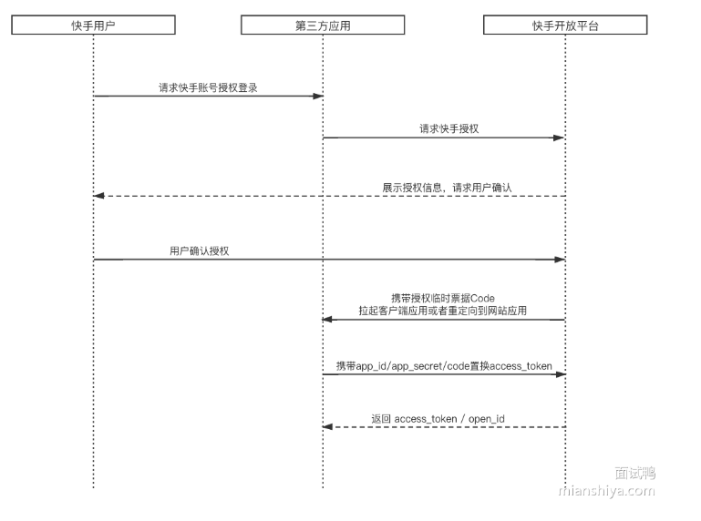

## cookie, session, token

http是无状态的协议，当想要获取用户的历史信息，比如登录的状态，就需要在每一次请求中携带对应的状态。cookie，session，token都是用来携带用户信息的方法。

#### 1. cookie

cookie是存储在客户端的一个小型文件，以键值对的方式存储。

6个重要属性：

- **path：** 设置在该站点下哪些页面可以访问cookie，通常是/，允许所有页面访问

- **domain：**设置哪些域可以访问cookie，例如设置为site.com，表示允许site.com及其子域（eg：xxx.sitem.com）访问
- **expires，max-age：**设置过期时间
- **secure：**设置仅https可以携带
- **samesite：**lax或者strict，lax允许跨站的GET请求以及通过浏览器顶部URL跳转的方式携带cookie，strict仅允许源站下的请求携带cookie
- **httpOnly：**设置cookie仅在http请求中可以访问，不能通过JavaScript脚本访问

缺点：

- 明文传输不安全

- 每次请求都会携带，消耗流量 

- 大小受限，最大4KB 

- 浏览器外的其他客户端必须手动设置cookie

#### 2. session

session用以解决cookie将用户信息明文存储在客户端不安全的问题，将用户信息存储在服务端，通过session来维护，并将sessionId通过cookie存储在客户端，通过sessionId查询用户登录信息

#### 3. token

##### 3.1 JWT(JSON Web Token)

将用户状态存储在服务端，在多台机器之间共享不方便，因此采用token的形式来将用户信息存储在客户端，每次由客户端携带，服务端进行鉴权。

token是通过特定算法对用户信息进行签名之后的字符串凭证，通过验证token的签名即可验证用户的信息，可以多机器，多应用使用。

- header——令牌元数据，类型以及签名算法等
- payload——传递的用户信息，不加密，存放敏感信息时需要进行加密
- signature——对header和payload采用特定算法进行签名，私钥签发token，公钥验证token
- 将header，payload，signature合在一起进行base64编码，通过.分离三部分，得到最后的token

##### 3.2 OAuth Token

用户通过开放平台授权来置换access token

1. 客户端请求开放平台授权
2. 客户端确认授权，开放平台返回授权码
3. 客户端携带授权码请求第三方应用服务
4. 第三方应用携带授权码和开放平台置换access token
5. 第三方应用返回access token给客户端，客户端授权成功

