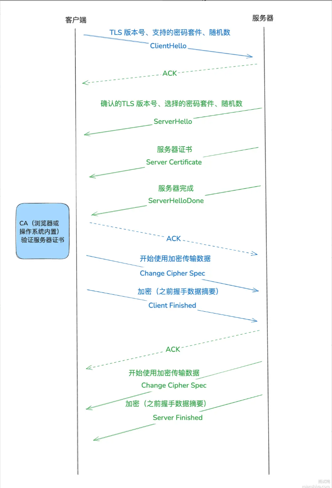

## HTTP

应用层的传输协议，无连接无状态，明文传输

HTTP不安全，明文传输，内容可能被窃听，不校验身份，可以遭遇伪装，无法验证报文完整性

### 1. 状态码

1xx 中间状态，需要后续操作

- 101 Switching Protocols，协议升级，切换到WebSocket

2xx 成功响应

- 200 OK 响应成功
- 201 Created 请求成功并创建了新的资源，常用于POST请求
- 204 Not Content 浏览器在处理复杂请求时发送的预检请求返回的响应码

3xx 重定向

- 301 Moved Permanently 永久重定向
- 302 Found 临时重定向
- 304 Not Modified 协商缓存

4xx 客户端错误

- 400 Bad Request 请求错误 通常是参数错误
- 401 Unauthorized 请求需要身份验证，没提供有效凭证token
- 403 Forbidden 无权限访问

- 404 Not Found 没找到资源

5xx 服务器端错误

- 500 服务器无法处理请求

### 2. HTTP缓存

- Cache-Control 
  - no-store，不适用缓存
  - no-cache，可以缓存，但需要协商，验证资源是否国企
  - pubilc，允许任何缓存，包括CDN，中间代理等
  - private，仅允许浏览器本地缓存
  - max-age：缓存事件
  - immutable，告诉浏览器这个资源不会更新，不需要重新请求
- Expries是服务器的绝对时间，客户端和服务器的时间可能不同步（有时差）
- max-age的优先级更高，http1.1引入，使用相对时间，两者同时存在会覆盖Expires

强缓存 

- Cache-Control 设置max-age比较长的时间，结合immutable
- 强缓存命中时，实际请求并没有发出去，而是浏览器从缓存中取出资源，返回200并带上From Cache的标识

协商缓存 

- Cache-Control 设置no-cache或者max-age=0，每次请求去服务器协商
  - max-age=0标识资源立即过期，浏览器仍可以使用缓存资源，需要去服务器协商
  - no-cache每次请求都要去服务器协商，即使未过期
- 缓存资源过期，未命中强缓存时，发起协商缓存
- Etag 
- If-None-Match 
- Last-Modified 
- If-Modified-Since
- Etag通过文件内容计算的哈希值，作为唯一标识符，资源对比成功返回304
- Last-Modified通过时间比对，对比成功返回304
- Etag的优先级更高，通过文件内容生成哈希值，只要文件内容不变，哈希值不变，但每次都需要进行哈希运算
  - 即使文件内容没有改动，文件的 **最后修改时间**（Last-Modified）可能仍然会变化（例如一些文件系统会自动更新修改时间）。这可能导致客户端误以为文件已更新，进而重新请求，而实际上文件内容并未改变
  - Last-Modified 只能**精确到秒级**，但如果某个文件在一秒内被多次修改，浏览器无法准确判断文件是否真的更新。而 **ETag** 允许服务器用唯一标识（如哈希值）判断文件是否变化，从而避免不必要的重新下载
  - 有些服务器无法准确获取文件的最后修改时间


### 3. HTTP版本

#### HTTP1.0 

- 短链接，每次请求都需要建立TCP连接

#### HTTP1.1 

- 持久连接，建立TCP连接之后可以复用
- 流水线方式，一次可以发送多个请求，服务器必须按请求的先后到达顺序依次进行处理，存在响应的队头阻塞
- 浏览器默认支持的最大TCP连接数为6个

#### HTTP2 

- 基于HTTPS，可以保障安全

对HTTP1.1的改进 

1. **头部压缩**，对多个请求的相同头部进行压缩， `HPACK` 算法：在客户端和服务器同时维护一张头信息表，所有字段都会存入这个表，生成一个索引号，以后就不发送同样字段了，只发送索引号对应的二进制帧，这样就提高速度了 
   - 静态表存储常用的头部，包含61个键值对，压缩成对应的索引发送
   - 动态表存储在当前连接中新增的头部字段，客户端和服务端都维护，第一次传输时添加，后续直接使用索引号
   - 哈夫曼编码，对头部值可变的字段进行值压缩，例如user-agent，在静态表中不会存储对应的值，实际传输值会使用哈夫曼编码进行压缩，高频字符采用短编码，低频字符采用长编码，哈夫曼树是带权路径和最短的二叉树，高频字符采用短编码，低频字符采用长编码，达到平均编码长度最短，尽可能地对数据进行压缩
2. 采用**二进制格式**， 不再是纯文本的传输，头部信息和数据体都是二进制，并且统称为帧（frame）：**头信息帧（Headers Frame）和数据帧（Data Frame）**。  直接解析二进制报文，这**增加了数据传输的效率**
3. **多路复用**，一个TCP连接可以并发多个请求和响应，解决HTTP1.1响应队头阻塞
4. 允许服务端主动推送数据

#### HTTP3

HTTP2解决应用层的队头阻塞，但由于TCP需要保证可靠传输，当出现丢包的情况，需要等待丢失的数据到达再处理后面的数据，因此在传输层仍然存在队头阻塞。

- 为了解决TCP队头阻塞，HTTP3传输层采用UDP，并在应用层（QUIC）实现TCP可靠的传输机制（超时重传，流量控制，拥塞控制），每个流之间彼此独立，当一个流的数据包丢失时只会影响该流，而其他流的数据仍可能正常使用，而HTTP2基于TCP，只要一个流的数据丢失，所有流都得等待重传
- 连接建立速度快，首次仅需1RTT的时间建立连接（两次握手确认连接ID），第二次连接可以0RTT，把数据和握手信息一起发送
- 由于TCP基于四元组（IP和端口号）进行传输，在切换网络时需要重新建立TCP连接，而QUIC使用Connection ID标识一个连接，只要ID不变，就可以达到0RTT的连接建立。

### 4. HTTPS

#### 为什么采用非对称加密，防止窃听

非对称加密用于密钥传输，协商密钥，保证通信密钥的安全，第三次握手时，即使密钥泄漏，也会由于没有私钥无法解密保证通信密钥安全

#### 为什么后续通信不沿用非对称加密

- 非对称加密计算量大，整个通信过程采用非对称加密会造成性能影响
- 对称加密速度快，适合大数据传输

对称加密用于实际数据传输，使用相同的密钥进行加密解密，计算效率高，速度快

#### 为什么需要CA签发数字证书

- 验证服务器身份，防止身份被冒充，公钥被伪造，中间人攻击就是伪造数字证书和公钥，植入操作系统，来进行中间窃听
- 数字证书的内容为，CA机构用自己的私钥将服务器的公钥进行的数字签名和服务器的公钥，只要能通过CA公钥认证服务器数字证书的可靠性，就证明身份可靠

在HTTP和TCP加入一层SSL/TSL协议进行加密传输

- 信息加密，采用混合加密的方式对数据进行加密传输

- 校验机制，采用摘要算法生成唯一的指纹用于校验，保证数据完整性

- 身份证书，需要到CA申请数字证书，将服务器公钥放入数字证书中，进行身份校验

- 对称加密，加密解密都是采用同一个密钥

- 非对称加密，用公钥进行加密，私钥进行加密

#### SSL/TSL通信过程（4次握手）

1. 客户端发起加密通信请求，TSL版本，加密算法，随机数
2. 服务器收到请求，确认TSL版本和加密算法，返回随机数和数字证书
3. 客户端收到证书，通过CA验证证书可靠性，拿到服务器的公钥，再次生成一个随机数，通过服务器公钥加密，发送给服务端
   - 浏览器验证过程：
     - 通过对消息内容计算哈希值，再通过私钥加密，如果通过公钥解密得到的内容和内容进行哈希运算的值一致，说明没有被篡改
     - 拿到证书，得到明文T（消息内容的哈希值），数字签名S（消息内容的哈希值进行加密）
     - 用CA机构（植入OS的证书）的公钥对S解密（由于是浏览器信任的机构，所以浏览器保有它的公钥。详情见下文），得到S’
     - 用证书里说明的hash算法对明文T进行hash得到T’
     - 比较S’是否等于T’，等于则表明证书可信
4. 服务器通过私钥解密得到随机数，随后双方都得到三个随机数，这三个随机数加密之后就是通信的密钥



### 5. HTTP报文

#### 请求报文

- 请求行  请求方法 请求资源 HTTP版本信息

- 请求头

- 空行 区别请求头和请求体

- 请求体

  - HTTP请求头Content-Type

  - 表单数据**application/x-www-form-urlencoded**，类似URL查询参数，以key，value对组成，由&分割

  - 传文件**multipart/form-data**
  
    - 有分隔符来隔离表单项
    - Content-Disposition标识哪个表单项，紧接着是实际的内容
  
    ```
    ------WebKitFormBoundaryxyz123
    Content-Disposition: form-data; name="username"
    
    john
    ------WebKitFormBoundaryxyz123
    Content-Disposition: form-data; name="avatar"; filename="profile.jpg"
    Content-Type: image/jpeg
    
    (binary file content...)
    ------WebKitFormBoundaryxyz123--
    ```

  - 二进制流**application/octet-stream**，直接传送二进制流，适合大文件

  - 秒传，以文件哈希标识一个文件，在传文件之前先请求后端是否存在文件，有则不必继续传输

  - 大文件分片上传，进行文件分块，每次传递一块formData和对应的index，支持断点续传
  
  ```javascript
  const file = document.querySelector('input[type="file"]').files[0];
  const chunkSize = 1024 * 1024; // 每个分片 1MB
  let start = 0;
  let chunkIndex = 0;
  
  function uploadChunk() {
    if (start >= file.size) {
      console.log("Upload complete");
      return;
    }
  
    const chunk = file.slice(start, start + chunkSize);
    const formData = new FormData();
    formData.append("file", chunk);
    formData.append("index", chunkIndex);
  
    fetch("/upload-chunk", { method: "POST", body: formData })
      .then(() => {
        start += chunkSize;
        chunkIndex++;
        uploadChunk();
      });
  }
  
  uploadChunk();
  
  ```
  
  - JSON数据**applocation/json**
  - XML数据**applocation/xml**
  - 文本数据**text/plain**

### 6. 请求方法

#### GET，POST区别

- 安全：不会破坏服务器资源
- 幂等：多次请求执行相同操作，结果也是相同的

- GET通常用来获取资源（安全且幂等），POST可能对服务器资源进行修改（不安全且不是幂等）
- GET通过URL查询传递参数，长度受限，POST参数在请求体中传递
- 明文传输，都不安全，GET的参数在URL中更显而易见
- 实际使用，GET请求也可能对服务器资源进行修改，也可以在请求体中传递参数，POST请求也可以在URL后面携带查询参数

#### PUT，PATCH

- PUT更新资源，PATCH更新部分资源

#### DELETE

- DELETE删除资源

#### OPTIONS

- 浏览器预检请求，判断服务器是否支持跨域资源共享

#### HEAD

- 获取资源元信息，只返回响应头，不返回响应体

## 7. HTTP流式传输

- Server-Sent-Events（SSE），仅支持单向通信和文本数据，从服务器向客户端发送数据
- 服务端响应时设置HTTP响应头为 Content-Type: text/event-stream
- SSE事件格式

```javascript
event: <事件名称>
id: <事件ID> // 断线重连后标识重新传输的数据，根据last-event-id来保证数据不中断
retry: <断线重连时间（毫秒）> // 断连时客户端等待多久重新连接
data: <事件数据>

id: 1
data: {"message": "Hello"}

id: 2
data: {"message": "World"}

const eventSource = new EventSource("/events");
eventSource.onmessage = function (event) {
  console.log("Received data:", event.data);
}
```

- 如果服务器想要浏览器停止重新连接，使用 HTTP 状态码 204 Not Content进行响应
- 如果浏览器想要关闭连接，则应该调用 `eventSource.close()`
- 当一个连接由于网络问题而中断时，客户端和服务器都无法确定哪些消息已经收到哪些没有收到

- 当收到具有 `id` 的消息时，浏览器会：
  - 将属性 `eventSource.lastEventId` 设置为其值
  - 重新连接后，发送带有 `id` 的 header `Last-Event-ID`，以便服务器可以重新发送后面的消息

- 连接状态

```javascript
EventSource.CONNECTING = 0; // 连接中或者重连中
EventSource.OPEN = 1;       // 已连接
EventSource.CLOSED = 2;     // 连接已关闭
```

