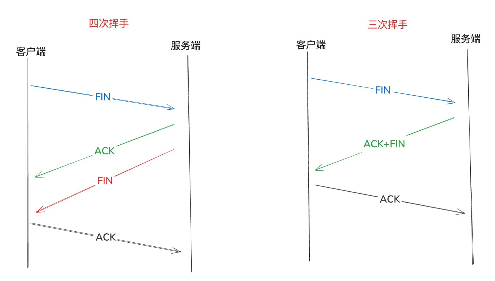

## 传输层

复用，应用层中不同进程的数据都可以使用同一个传输层协议传输数据

分用，接收方接收到传输层数据后交付给应用层不同的进程

差错检测，对报文进行差错检测，检测出错则将报文丢弃

#### TCP

- 面向连接，需要先建立连接再进行数据传输，传输结束后需要释放连接

- 不提供广播或多播服务，属于端到端的通信，可靠传输

- 需要增加许多开销，首部开销，缓存，重传和计时器，连接管理等，时延大，适合传输大文件和需要可靠传输数据

- 可靠传输，保证数据无差错，有序，不重复，不丢失

- 全双工通信，发送方和接收方都可以互发数据，都需要有发送和接收缓存，存储接收的数据和发送的数据

#### 1. TCP和UDP的区别

TCP和UDP最本质的区别就是能不能保证可靠传输，UDP不保证可靠传输，因此不必有TCP进行流量控制和拥塞控制的机制，也不必有保证数据按序到达的重传机制。由于UDP没有额外的机制，也不必有首部的字段开销，因此UDP的性能较高，延迟较低，更适合实时性较高的场景。

#### 2. UDP报文结构

UDP首部只需要有四部分信息

- 源端口号，2B，16位
- 目的端口号，2B，16位
- UDP报文长度，2B，16位，包括首部和数据，最低为8B，即仅有首部
- UDP校验和，2B，16位，校验UDP数据在传输过程中是否出错，可选字段，不校验全为0即可

#### 3. TCP报文结构

TCP需要额外的机制来保证可靠传输，首部也需要额外的开销

**核心字段**

- 源端口号，2B，16位
- 目的端口号，2B，16位
- 序号seq，4B，32位，字节流的序号
- 确认号ack，4B，32位，返回给发送方的确认序号
- 数据偏移，4位，TCP首部长度，以4B位单位，最低20B
- 确认位ACK，1位，ACK=1表示确认号有效，连接建立后ACK=1
- 同步位SYN，1位，用于连接建立，SYN=1
- 终止位FIN，1位，用于连接释放，FIN=1
- 窗口，2B，位，滑动窗口大小，即允许对方发送的数据量
- 选项，长度可变，包含MSS，最大报文段长度

#### 4. TCP三次握手

**TCP建立连接三次握手**

1. 客户端向服务器端发送请求连接报文（SYN=1,ACK=0,seq=x）
2. 服务端为该TCP连接分配缓存和变量，并向客户端发送同意建立连接报文（SYN=1,ACK=1,seq=y,ack=x+1）
3. 客户端为该TCP连接分配缓存和变量，并向服务器端发送确认的确认报文，此时可以携带数据（捎带确认）(ACK=1,seq=x+2,ack=y)

**三次握手的原因：**

- 避免历史错误的连接建立，当历史请求被阻塞时，发送方会重复发送连接建立请求，此时若接收方接收了错误的连接，仅靠两次握手无法建立起正确的连接，需要第三次握手由发送方发送重置连接请求建立正确的连接
- 帮助通信双方初始化序列号，三次握手可以帮助双方初始化字节流序号，第一次发送方发送序号，第二次接收方确认的同时发送序号，第三次发送方发送确认号，第二次握手合并了两次握手需要做的事情

理论上三次以上的握手都可以，但三次已经足够，没必要多次

**第二次握手SYN+ACK**

- 如果第二次握手之后，服务端没有收到客户端的ack，会尝试多次重试（重传SYN+ACK），等待ack到达，如果重试之后没有收到ack则断开连接释放资源
- 基于此，有了SYN洪泛攻击（拒绝服务攻击 DoS），就是多次发送第一次握手的SYN包，而不发送第三次握手的ack包，导致服务器资源耗尽，防御手段可以缩短重试的次数和时间

#### 5. TCP四次挥手

**TCP释放连接四次挥手，两次FIN+ACK**

​	1.客户端向服务端发送终止连接请求（FIN=1,seq=u）

​	2.服务端向客户端发送确认释放连接报文（ACK=1,seq=v，ack=u+1），此时客户端不能再向服务器端发送数据，服务器端仍可以发送数据给客户端，TCP连接处于半关闭。

​	3.服务端在发送完剩余数据之后，向客户端发送释放连接请求（FIN=1,seq=w）

​	4.客户端发送确认报文（ACK=1,seq=u+1，ack=w+1），客户端等待2MSL（最长报文段寿命比2倍RTT稍长，防止确认报文丢失，服务器重新发送释放连接请求时可以重传确认报文）后，TCP连接释放。

**四次挥手的原因**

确保数据完成收到，一次FIN，一次ACK

**四次挥手合并成三次挥手**

当客户端向服务端发送释放连接请求时，若服务端已没有数据需要发送，此时可以跟建立连接一样，将FIN合并到第二次握手中发送，合并为三次挥手

**等待2MSL的原因**

- **确保最后一个ACK被接收**，MSL时最大报文段寿命，即TCP报文段在网络中存在的最大时间，当最后一个ACK没被接收时，服务端会重发FIN数据包，客户端接收到重发的FIN之后再次发送ACK，一来一回就是2MSL
- **确保旧的报文段不影响新连接**，等待2MSL可以使延时到达的报文段全部超时失效之后才允许重新建立连接

#### 6. 重传机制

- 超时重传，设定定时器，超过指定时间未收到确认就重新发送，超时时间比根据实际RTT（往返时间，发送到收到确认）采样的时间RTTs略大
- 冗余ACK（快速重传），当网络情况正常时，没必要等待超时再发送，当连续收到3个重复的ACK时，此时可以确认数据包丢失，直接重传，例如发送了1，2，3，4，5，2丢失，3，4，5的确认都是2时可以重传

#### 7. 流量控制

基于滑动窗口机制实现流量控制，TCP报文段首部的窗口字段标明了接收方的窗口大小，发送方可以根据这个窗口值调整发送的数据量，避免发送过快，导致接收方处理不过来，缓存溢出。

**滑动窗口机制**

对字节流编号之后，在字节流上形成一个发送窗口，每接收到对应的ACK之后，例如接收到5的ACK，代表0~5的数据包都已经被接收（累计确认机制），此时可以移动发送窗口到5之后，形成新的发送窗口。

**为什么有滑动窗口还要进行拥塞控制**

滑动窗口用于协调通信双方的处理能力，拥塞控制时避免网络过于拥堵导致数据包丢失，当网络过于拥堵时，可以调整发送方的发送速率避免网络进一步拥堵。

#### 8. 拥塞控制

- **慢开始**

连接建立初期使用慢开始算法，拥塞窗口设置为1，每收到一个ACK，发送窗口指数增长

- **拥塞避免**

当拥塞窗口增长到阈值时，使用拥塞避免算法，由指数增长改为线性增长

- **快重传**

当收到3个冗余的ACK时，直接快速重传丢失的数据，并且将阈值设置为此时拥塞窗口的一半，不必等待超时

- **快恢复**

直接令拥塞窗口=新阈值，执行拥塞避免算法，慢开始算法则是令拥塞窗口=1，重新执行慢开始算法

