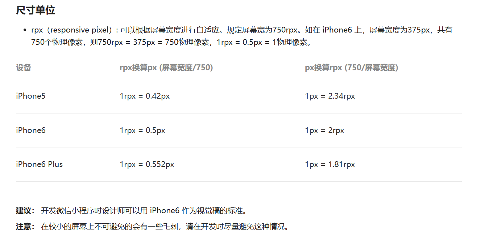

## RYMusic

#### 功能：

1. 小程序登录功能
2. 首页歌曲信息展示，歌单详情页跳转，播放状态工具栏展示
3. MV信息页展示(下拉加载更多，上拉刷新)，MV播放页
4. 搜索页，热门搜索，历史搜索，搜索建议，搜索结果展示
5. 播放器功能，上一首下一首，播放暂停，播放模式切换

#### 小程序的双线程模型

小程序的双线程模型是渲染层和逻辑层是单独的线程，逻辑层基于JSCore来执行JS代码，不能直接操作DOM，通过setData的方式与渲染层进行通信，触发界面的更新；渲染层基于WebView来进行UI渲染，负责解析WXML和WXSS，与逻辑层的通信通过事件机制触发。这种设计主要提升性能，逻辑层的代码执行不会阻塞UI渲染。

通信流程：

1. 调用setData，将数据序列化为JSON字符串
2. 将数据传输给渲染层
3. 渲染层接收到数据后，合并新旧数据，经过VDOM的DIFF，将差异部分更新到UI


#### 小程序的生命周期

- onLaunch，小程序初始化，首次打开时执行
- onShow，小程序启动或者是从后台进入前台
- onHide，小程序进入后台


##### 页面生命周期

- onLoad，初次加载执行，只会执行一次
- onShow，页面显示执行，页面每次显示时都会执行
- onReady，页面渲染成功执行
- onHide，页面隐藏执行
- onUnload


##### 组件生命周期

- created，组件创建
- attached，组件进入页面节点树
- ready，组件布局完成
- detached，组件卸载


#### 小程序启动策略

小程序切换到后台，5秒后挂起，30分后销毁

- 冷启动：初次加载时或者小程序销毁后需要重新加载启动
- 热启动：小程序未销毁，从后台进入前台


#### 项目亮点及遇到的问题：

- 小程序分包，分包可以减少首页加载的代码量，只加载主包，提高首页渲染速度，并让小程序在空闲时刻将对应的分包下载下来，也可以在进入对应页面时再加载对应的包，但可能会造成渲染延迟
  - app.json配置子包subPackage，详情页包（歌曲，菜单，视频，搜索），播放器页包
  - app.json配置preloadRule，配置加载规则，进入首页时预加载子包，配置预加载可以在跳转到分包页面时降低延迟

```json
"subPackages": [
    {
      "root": "packageDetail",
      "name": "pDetail",
      "pages": [
        "pages/detail-menu/index",
        "pages/detail-search/index",
        "pages/detail-songs/index",
        "pages/detail-video/index"
      ]
    },
    {
      "root": "packagePlayer",
      "name": "pPlayer",
      "pages": [
        "pages/music-player/index"
      ]
    }
],
"preloadRule": {
    "pages/home-music/index": {
      "network": "all",
      "packages": ["packageDetail", "packagePlayer"]
    }
}
```

- swiper组件制作轮播图时，swiper组件有默认高度，因此需在图片加载完成之后动态获取图片高度后给swiper组件设置高度，并且对动态获取高度的函数做了节流处理
  - 为什么不选防抖而选节流？结合下面的bug出现原因
  - 在这个过程中遇到小程序的一个bug，由于设置的节流频率过低，在图片加载比较快时节流函数只会执行一次，因此在图片初次加载完成之后没有准确地获取到image组件的高度
    - 解决方案一：让节流函数最后一次一定会调用一次，即获取最后一次加载完图片获取到的image组件高度
    - 解决方案二：将节流函数的频率调高，能够执行多次
  - 每次图片加载完成之后都会触发函数执行，为了优化性能，进行节流处理


```javascript
function queryComponentRect(selector, component) {
  return new Promise(resolve => {
    const query = wx.createSelectorQuery().in(component)
    query.select(selector).boundingClientRect(resolve).exec()
  })
}

const throttleQueryRect = throttle(queryComponentRect, 1000, { trailing: true })

handleSwiperImageLoaded() {
  //图片加载完成之后获取组件的高度
  throttleQueryRect('.swiper-image', this).then(
    res => {
      this.setData({
        swiperHeight: res.height
      })
    }
  )
}
```

- 搜索建议做了防抖处理
  - 当输入完关键词之后删除过快，会出现当搜索内容为空时仍显示搜索建议内容
  - 原因是做了防抖处理之后，当删除内容过快，时间快于防抖延迟的时间时，监听搜索框变化的事件处理器最后一次执行时，搜索内容为空，会直接返回，不会取消定时器，因此上一次的网络请求仍然发送出去了，所以页面有了数据就渲染出来了
  - 解决方案是在最后一次执行时调用防抖函数的取消功能，当搜素内容为空时，取消上一次的网络请求

```javascript
const debounceGetSearchSuggest = debounce(getSearchSuggest, 300)

async handleSearchChange(event) {
    const searchValue = event.detail
    this.setData({ searchValue })

    if (!searchValue.length) {
      this.setData({
        suggestSongs: [],
        suggestSongsNodes: [],
        resultSongs: []
      })
      debounceGetSearchSuggest.cancel()
      return
    }

    const res = await debounceGetSearchSuggest(searchValue)
    // if (!this.data.searchValue.length) return 
    const suggestSongs = res.result.allMatch
    this.setData({ suggestSongs })
    if (!suggestSongs) return

    const suggestKeyWords = suggestSongs.map(item => item.keyword)
    const suggestSongsNodes = []
    for (const keyWord of suggestKeyWords) {
      const nodes = stringToNodes(keyWord, searchValue)
      suggestSongsNodes.push(nodes)
    }
    this.setData({ suggestSongsNodes })
}
```

- 做搜索建议功能时用了一个富文本组件，需要传递对应的虚拟节点，用以高亮显示与关键词匹配的文字
  - 解析服务器返回的搜索建议文本
  - 将与关键词匹配的文本的设置为active，虚拟节点内容name，attrs，children

```javascript
function stringToNodes(keyWord, value) {
  const nodes = []
  
  if (keyWord.toUpperCase().startsWith(value.toUpperCase())) {
    const key1 = keyWord.slice(0, value.length)
    const node1 = {
      name: 'span',
      attrs: { class: 'active-text'},
      children: [{ type: 'text', text: key1}]
    }

    const key2 = keyWord.slice(value.length)
    const node2 = {
      name: 'span',
      attrs: { class: 'text'},
      children: [{ type: 'text', text: key1}]
    }
    nodes.push(node1, node2)
  } else {
    const node = {
      name: 'span',
      attrs: { className: 'text'},
      children: [{ type: 'text', text: keyWord}]
    }
    nodes.push(node)
  }

  return nodes
}
```

- 播放器页面动态获取设备高宽比，根据设备高宽比决定是否显示歌词区域，以适配在较小机型的布局不会出现错乱
  - app.js，小程序启动时获取设备高度和宽度，计算设备高宽比
  - 为了页面的美观，计算并设置播放器页面内容的高度，屏幕高度 - 状态栏高度 - 导航栏高度
  - 由于播放器页面高度已设置固定值，当设备高度过小时（比如iphone6），内容显示会错乱，因此根据高宽比 > 2决定是否显示歌词

```javascript
globalData: {
    screenWidth: 0,
    screenHeight: 0,
    statusBarHeight: 0,
    navBarHeight: 44,
    deviceRadio: 0,
}

//1.获取设备信息
const info = wx.getSystemInfoSync()
this.globalData.screenWidth = info.screenWidth
this.globalData.screenHeight = info.screenHeight
this.globalData.statusBarHeight = info.statusBarHeight

//2.获取设备高宽比
const deviceRadio = info.screenHeight / info.screenWidth
this.globalData.deviceRadio = deviceRadio

setContentHeight() {
    const globalData = getApp().globalData
    const screenHeight = globalData.screenHeight
    const statusBarHeight = globalData.statusBarHeight
    const navBarHeight = globalData.navBarHeight
    const contentHeight = screenHeight - statusBarHeight - navBarHeight
    this.setData({ contentHeight })
    const deviceRadio = globalData.deviceRadio
    this.setData({ isMusicLyric: deviceRadio >= 2 })  
}
```

- rpx相对单位，响应式单位，可以根据屏幕宽度自适应，由微信底层进行单位换算，屏幕宽为750rpx



- 用CSS伪类:empty解决小程序插槽没有插入内容时，显示默认内容

```css
.header .slot:empty + .default {
  display: flex;
}

.header .default {
  display: none;
  align-items: center;
  font-size: 28rpx;
  color: #777;
}
```

- 封装event-store库来进行数据共享和状态管理（具备响应式）
  - 管理全局信息，播放状态，播放模式，正在播放歌曲，歌曲列表等
  - 事件总线，核心就是on和emit函数，on监听事件，emit触发事件
  - 设计上借鉴了现有状态管理库，state存放状态，dispatch分发action修改状态
  - 通过onState(stateKey, cb)注册事件
  - 对state进行数据代理，在setter拦截器中触发事件

```javascript
const playerStore = new EventStore({
  state: {
    isFirstPlay: true,

    id: 0,
    currentSong: {},
    durationTime: 0,
    lyrics: [],

    currentTime: 0,
    currentLyricIndex: 0,
    currentLyricText: '',

    playModeIndex: 0 ,// 0:顺序播放 1：单曲循环 2: 随机播放
    playListSongs: [],
    playListIndex: 0,
    isShowPlayListSongs: false,
    playingName: 'playing',
    playAnimState: 'running',

    historyPlaySongList: []
  },
  actions: {
    playMusicWithSongIdAction(ctx, { id, isRefresh = false }) {
      if (ctx.id == id && !isRefresh ) {
        const isPlaying = audioContext.paused
        if (isPlaying) {
          this.dispatch('changeMusicPlayStatuAction')
        }
        return
      }else if (ctx.id == id && isRefresh) {
        audioContext.stop()
        audioContext.play()
        return
      }

      ctx.id = id
      ctx.currentSong = {}
      ctx.durationTime = 0
      ctx.lyrics = []
      ctx.currentTime = 0
      ctx.currentLyricIndex = 0
      ctx.currentLyricText = ''

      getSongDetail(id).then(res => {
        ctx.currentSong = res.songs[0]
        ctx.durationTime = res.songs[0].dt
        // audioContext.title = res.songs[0].name
        for(let i = 0; i < ctx.historyPlaySongList.length; i++) {
          if (ctx.historyPlaySongList[i].id === ctx.currentSong.id) {
            ctx.historyPlaySongList.splice(i, 1)
            break
          }
        }
        ctx.historyPlaySongList.unshift(ctx.currentSong)
        setStorageParse(HISTORYPLAYSONGLIST_KEY, ctx.historyPlaySongList)
      })
  
      getSongLyric(id).then(res => {
        const lyricString = res.lrc.lyric
        const lyrics = parseLyric(lyricString)
        ctx.lyrics = lyrics
      })

      audioContext.stop()
      audioContext.src = `https://music.163.com/song/media/outer/url?id=${id}.mp3`
      audioContext.autoplay = true

      if (ctx.isFirstPlay) {
        this.dispatch('setupAudioContextListenerAction')
        console.log(ctx.isFirstPlay)
        ctx.isFirstPlay = false
      }
    },

    setupAudioContextListenerAction(ctx) {
      audioContext.onCanplay(() => {
        audioContext.play()
      })
      audioContext.onTimeUpdate(() => {
        const currentTime = audioContext.currentTime * 1000
        ctx.currentTime = currentTime
  
        if (!ctx.lyrics.length) return
        let i = 0
        for (; i < ctx.lyrics.length; i++) {
          const lyric = ctx.lyrics[i]
          if (currentTime < lyric.time) {
            break
          }
        }

        const currentIndex = i - 1
        if (ctx.currentLyricIndex !== currentIndex) {
          const currentLyric = ctx.lyrics[currentIndex]
          const currentLyricText = currentLyric.text
          ctx.currentLyricIndex = currentIndex
          ctx.currentLyricText = currentLyricText
        }
      })
      audioContext.onEnded(() => {
        this.dispatch('changeNewMusicAction')
      })
    },

    changeMusicPlayStatuAction(ctx) {
      const isPlaying = audioContext.paused
      if (isPlaying) {
        audioContext.play()
        this.setState('playingName', 'playing')
        this.setState('playAnimState', 'running')
      }else {
        audioContext.pause()
        this.setState('playingName', 'pause')
        this.setState('playAnimState', 'paused')
      }
      // isPlaying ? audioContext.play() : audioContext.pause()
    },

    changeNewMusicAction(ctx, isNext = true) {
      let index = ctx.playListIndex

      switch(ctx.playModeIndex) {
        case 0:
          index = isNext ? index + 1 : index - 1
          if (index === -1) index = ctx.playListSongs.length - 1
          if (index === ctx.playListSongs.length) index = 0
          break
        case 1: 
          break
        case 2:
          index = Math.floor(Math.random() * ctx.playListSongs.length)
          break
      }
    
      let currentSong = ctx.playListSongs[index]
      if (!currentSong) {
        currentSong = ctx.currentSong
      }else {
        ctx.playListIndex = index
      }

      this.dispatch('playMusicWithSongIdAction', { id: currentSong.id, isRefresh: true })
    }
  }
})
```

- CSS滤镜实现毛玻璃效果

```css
.header .bg-cover {
  position: absolute;
  z-index: -1;
  top: 0;
  left: 0;
  width: 100%;
  height: 100%;
  background-color: rgba(0,0,0,.5);
  backdrop-filter: blur(5px);
}
```

- 进度匹配歌词，当前时间去歌词数组里面查找到对应的歌词，找到时间大于当前的歌词，上一句即为匹配到的歌词
  - 根据当前进度和总时间计算当前时间，去歌词数组找到第一个大于当前时间的歌词，前一个即为匹配到的歌词