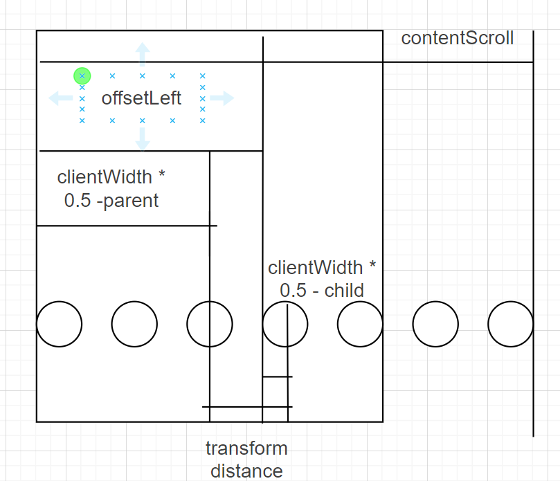

## React-air

#### 1. 代码规范

- 统一采用函数式组件进行开发，并采用memo进行包裹
- 组件CSS统一采用styled-components编写，并在JSX中包裹外层容器<ComponentWrapper>
- 代码缩进采用两个空格，字符串采用双引号，代码结尾不加分号
- 组件命名采用大驼峰，变量和函数命名采用小驼峰，常量统一为大写字母
- 网络请求相关代码以及数据管理统一放在redux中进行管理，并按照页面(首页，浏览页，详情页)进行模块划分

```react
import { memo, useRef, useEffect } from "react"
import type { ReactNode, FC } from "react"
import { IndicatorWrapper } from "./style"

interface IProps {
  selectedIndex: number
  children?: ReactNode
}

const Indicator: FC<IProps> = memo((props) => 
{
  const { selectedIndex } = props
  const contentRef = useRef<HTMLDivElement | null>(null)

  useEffect(() => {
    // 1.获取selectIndex对应的item
    const parentEl = contentRef.current!
    const selectedEl = parentEl.children[selectedIndex] as HTMLElement
    const itemLeft = selectedEl.offsetLeft
    const itemWidth = selectedEl.clientWidth
    // 2.content的宽度
    const contentWidth = parentEl.clientWidth
    const contentScroll = parentEl.scrollWidth
    // 3.获取selectIndex要滚动的距离
    let distance = itemLeft + itemWidth * 0.5 - contentWidth * 0.5
    // 4.特殊情况的处理
    if (distance < 0) distance = 0 // 左边的特殊情况处理
    const totalDistance = contentScroll - contentWidth
    if (distance > totalDistance) distance = totalDistance // 右边的特殊情况处理

    // 5.改变位置即可
    parentEl.style.transform = `translate(${-distance}px)`
  }, [selectedIndex])
  
  return (
    <IndicatorWrapper>
      <div className="indiactor-list" ref={contentRef}>{props.children}</div>
    </IndicatorWrapper>
  )
})

export default Indicator
```

```js
import styled from "styled-components"

export const IndicatorWrapper = styled.div`
  overflow: hidden;

  .indiactor-list {
    display: flex;
    position: relative;
    transition: transform 200ms ease;

    > * {
      flex-shrink: 0;
    }
  } 
`
```

- **最佳实践**
  - 根据业务进行模块划分，service请求代码，store数据请求统一管理，模块之间一一对应。页面 -> service -> store，可以结合项目举个例子，这样划分模块，代码结构更清晰，也增加了代码的可维护性和扩展性，修改对应的模块，只需要去修改对应模块的代码，增加模块，也只需要增加新的模块，不需要修改原有代码。

#### 2. TS的使用

- redux中使用ReturnType工具拿到getState的返回值，作为泛型传递给useSelector，在编写代码时获取类型提示

```typescript
export type TRootState = ReturnType<typeof store.getState>
type AppDispatch = () => typeof store.dispatch

export const useAppSelector: TypedUseSelectorHook<TRootState> = useSelector
export const useAppDispatch: AppDispatch  = useDispatch
export const appShallowequal = shallowEqual
```

- 绑定组件ref，使用InstanceType工具获取组件实例类型
- 接口和类型定义，泛型(使用最多)
  - 组件Prop类型
  - API类型
  - styled-components传递泛型
- 枚举类型，一般作为常量枚举，项目中定义WebSocket消息类型以及动作类型
- 联合类型
- 索引类型，遍历对象时经常报错没有索引类型，可以通过定义类型断言以及定义索引类型
- 类型断言，as
- 非空类型断言，！

#### 3. 组件封装

- 轮播指示器组件
  - 让选中元素在中间显示
  - 指示器的内容由父组件传递，props.children
  - 使用useEffect在selectedIndex发生变化重新计算偏移量
  - 获取选中元素相对于父元素的左边距偏移量offsetLeft（offset为相对父元素的偏移量）
  - 获取选中元素的可见宽度clientWidth
  - 获取父元素的可见宽度clientWidth
  - 计算偏移距离 = 左偏移量 + 元素可见宽度一半 - 父元素可见宽度一半
  - 边界元素处理：最左边和最右边元素不进行位移
  - 最左边元素：偏移距离小于0
  - 最右边元素：偏移距离大于总偏移距离contentScroll - contentWidth




```javascript
useEffect(() => {
    // 1.获取selectIndex对应的item
    const parentEl = contentRef.current!
    const selectedEl = parentEl.children[selectedIndex] as HTMLElement
    const itemLeft = selectedEl.offsetLeft
    const itemWidth = selectedEl.clientWidth
    // 2.content的宽度
    const contentWidth = parentEl.clientWidth
    const contentScroll = parentEl.scrollWidth
    // 3.获取selectIndex要滚动的距离
    let distance = itemLeft + itemWidth * 0.5 - contentWidth * 0.5
    // 4.特殊情况的处理
    if (distance < 0) distance = 0 // 左边的特殊情况处理
    const totalDistance = contentScroll - contentWidth
    if (distance > totalDistance) distance = totalDistance // 右边的特殊情况处理

    // 5.改变位置即可
    parentEl.style.transform = `translate(${-distance}px)`
}, [selectedIndex])
```

- 图片浏览（遮罩层）
  - 使用useEffect在组件添加到DOM时body设置为overflow：hidden，组件移除时body设置为overflow：auto，因为该组件为遮罩层，用fixed定位设置铺满body，底下其他层仍会显示需要隐藏
  - 图片浏览区域，使用index控制图片浏览顺序
  - 预览区域，使用指示器组件，同样使用index控制图片浏览顺序

```react
position: fixed;
z-index: 999;
left: 0;
right: 0;
top: 0;
bottom: 0;

useEffect(() => {
    document.body.style.overflow = "hidden"
    return () => {
      document.body.style.overflow = "auto"
    }
}, [])

<SwitchTransition mode="in-out">
    <CSSTransition
      key={pictureUrls[currentIndex]}
      classNames="pic"
      timeout={200}
    >
      
    </CSSTransition>
</SwitchTransition>

<Indicator selectedIndex={currentIndex}>
  {pictureUrls?.map((item: string, index: number) => {
    return (
      <div
        className={classNames("item", {
          active: currentIndex === index
        })}
        key={item}
        onClick={() => handleBottomItemClick(index)}
      >
        
      </div>
    )
  })}
</Indicator>
```

- ScrollView
  - 使用useState存储偏移量
  - 使用useEffect在组件挂载时计算总偏移距离contentEl.scrollWidth - contentEl.clientWidth，并判断是否可以滚动显示向右滚动按钮
  - 使用useRef存储偏移距离distance和index，需要依赖上一次的distance和index
  - 每次点击向右滚动时偏移量为下一个元素的offsetLeft，每次点击向左滚动时偏移量为上一个元素的offsetLeft
  - 显示向右滚动按钮：偏移量小于总偏移量
  - 显示向左滚动按钮：偏移量大于0

```react
const ScrollView: FC<IProps> = memo((props) => {
  const [showLeft, setShowLeft] = useState(false)
  const [showRight, setShowRight] = useState(false)
  const [offset, setOffset] = useState("0px")
  const scrollContentRef = useRef<HTMLDivElement | null>(null)
  const distanceRef = useRef(0)
  const indexRef = useRef(0)

  useEffect(() => {
    const contentEl = scrollContentRef.current!
    const distance = contentEl.scrollWidth - contentEl.clientWidth
    distanceRef.current = distance
    setShowRight(distance > 0)
  }, [props.children])

  const handleIconClick = (isRight: boolean) => {
    const newIndex = isRight ? ++indexRef.current : --indexRef.current
    const newEl = scrollContentRef.current!.children[newIndex] as HTMLElement
    setOffset(`-${newEl.offsetLeft}px`)
    setShowRight(distanceRef.current > newEl.offsetLeft)
    setShowLeft(newEl.offsetLeft > 0)
  }

  return (
    <ScrollViewWrapper offset={offset}>
      {showLeft && (
        <div className="control left" onClick={() => handleIconClick(false)}>
          <IconArrowLeft />
        </div>
      )}
      {showRight && (
        <div className="control right" onClick={() => handleIconClick(true)}>
          <IconArrowRight />
        </div>
      )}
      <div className="scroll">
        <div className="scroll-content" ref={scrollContentRef}>
          {props.children}
        </div>
      </div>
    </ScrollViewWrapper>
  )
})
```

#### 4. 动画优化

will-change不能滥用，以内存为代价，will-change应该为那些经常执行的动画设置

- 指示器组件使用transform作为位移过渡动画
- 图片浏览组件使用SwitchTransition和CSSTransition动态添加类名，结合transform和opacity制作进场退场动画
- 图片浏览组件预览区域用height和will-change制作显示隐藏动画
- ScrollView组件使用transform作为位移动画

- 图片详情页 图片交互动画
  - 处于焦点的图片有放大动画 其他图片覆盖上遮罩层
  - 遮罩层透明度默认为0 处于焦点的图片遮罩层透明度为0 其他为1

```html
<div className="pictures">
    <div className="left">
      <div className="item" onClick={() => setShowBrowser(true)}>
        
        <div className="cover"></div>
      </div>
    </div>
    <div className="right">
      {detailInfo?.picture_urls?.slice(1, 5).map((item: string) => {
        return (
          <div
            className="item"
            key={item}
            onClick={() => setShowBrowser(true)}
          >
            
            <div className="cover"></div>
          </div>
        )
      })}
    </div>
</div>
```

```css
&:hover {
  .cover {
    opacity: 1 !important;
  }

  .item:hover {
    .cover {
      opacity: 0 !important;
    }
  }
}

img {
    width: 100%;
    height: 100%;
    object-fit: cover;
    transition: transform 0.3s ease-in;
}

.cover {
    position: absolute;
    left: 0;
    right: 0;
    top: 0;
    bottom: 0;
    background-color: rgba(0, 0, 0, 0.3);
    opacity: 0;
    transition: opacity 200ms ease;
}

&:hover {
    img {
      transform: scale(1.08);
    }
}
```

- 顶部导航栏缩放动画

  - 触发动画，滚动时显示固定导航栏，到达顶部时显示透明的搜索内容

    - 监听滚动事件，获取y轴滚动位置，封装了hook，调用set会触发组件重新渲染，进行节流处理
    - useState存储滚动位置，useEffect组件挂载时监听window的scroll事件，组件移除时移除事件监听器

    ```javascript
    import { throttle } from "@/utils"
    import { useEffect, useState } from "react"
    
    export default function useScrollPosition() {
      const [scrollX, setScrollX] = useState(0)
      const [scrollY, setScrollY] = useState(0)
    
      const handleScroll = throttle(
        () => {
          setScrollX(window.scrollX)
          setScrollY(window.scrollY)
        },
        100,
        {
          leading: true,
          trailing: true
        }
      )
    
      useEffect(() => {
        window.addEventListener("scroll", handleScroll)
    
        return () => {
          window.removeEventListener("scroll", handleScroll)
        }
      }, [])
    
      return { scrollX, scrollY }
    }
    
    ```

  - 点击时触发动画

  - CSSTransition动态添加类名，组件切换执行缩放动画进场退场，退场时销毁

  - 搜索内容进场时从小到大，透明度从0到1，退场时从大到小，透明度从1到0

    - 进场时包括搜索内容的容器执行高度从0到100的动画，退场时执行高度从100到0的动画

  - 搜索框进场时从大到小，透明度从0到1，退场时透明度从1到0

```react
<CSSTransition
  in={!isSearch}
  classNames="bar"
  timeout={250}
  unmountOnExit={true}
>
    <div className="search-bar" onClick={handleSearchBarClick}>
      <div className="text">搜索房源和体验</div>
      <div className="icon">
        <IconSearchBar />
      </div>
    </div>
</CSSTransition>
<CSSTransition
  in={isSearch}
  classNames="detail"
  timeout={250}
  unmountOnExit={true}
>
    <div className="search-detail">
      <SearchTabs titles={titles} tabClick={setTabIndex} />
      <div className="search-info">
        <SearchContent searchInfo={SearchTitles[tabIndex].searchInfo} />
      </div>
    </div>
</CSSTransition>
```

```css
transform-origin: 50% 0;
will-change: transform, opacity;

.bar-enter {
    transform: scale(2.85714, 1.375) translateY(58px);
    opacity: 0;
}

.bar-enter-active {
    transition: all 250ms ease;
    transform: scale(1) translateY(0);
    opacity: 1;
}

.bar-exit {
    opacity: 0;
}

.detail-exit {
    transform: scale(1) translateY(0);
    opacity: 1;
}

.detail-exit-active {
    transition: all 250ms ease;
    transform: scale(0.35, 0.727273) translateY(-58px);
    opacity: 0;
}

.detail-enter {
    transform: scale(0.35, 0.727273) translateY(-58px);
    opacity: 0;
}

.detail-enter-active {
    transform: scale(1) translateY(0);
    opacity: 1;
    transition: all 250ms ease;
}
```

```react
const propNames = ["isSearch"]
export const SearchAreaWrapper = styled.div.withConfig({
  shouldForwardProp: (props) => forwardProps(props, propNames)
})<TSearchArea>`
  height: ${(props) => (props.isSearch ? "100px" : "0")};
  will-change: height;
  transition: height 250ms ease;
`
<SearchAreaWrapper isSearch={isAlpha || isSearch} />
```

#### 5. 性能优化措施

- 使用 memo 包裹组件，在 prop 不发生变化时不会重新渲染，浅层比较
- useCallback 包裹传递给子组件的事件处理函数，返回记忆化的函数，为 memo 服务
- useSelector shallowEqual 与 memo 同理
