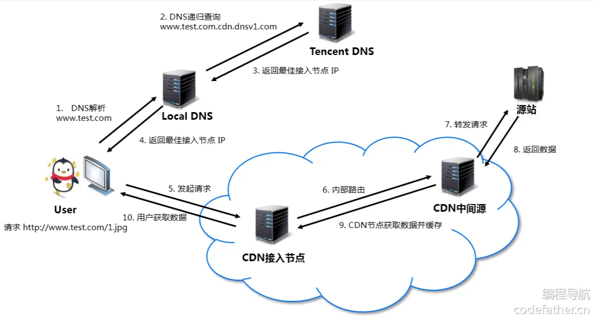

## 性能优化

### 一. 开发优化

#### 1. CSS优化

优先使用CSS transform和opacity来完成动画，合理使用will-change来告知浏览器提前进行优化，减少使用JavaScript动画，避免浏览器回流。在Vue和React中，实现动画的组件也是使用CSS动画，通过动态添加类名来实现。

#### 2. 防抖和节流

对于频繁触发的事件（输入框，滚动事件）使用防抖和节流，减少触发的频率。

#### 3. 避免内存泄漏

合理使用闭包，及时清理定时器，事件监听器，websocket连接（组件销毁时）等，避免内存泄漏。

#### 4. 执行大量任务

- 将复杂繁重的任务放到Web Worker线程中执行，避免阻塞主线程
- 将任务分批次执行，使用requestAnimationFrame(cb)让浏览器在渲染完（每秒60帧）之后的空闲时间执行任务，或使用setTimeout等事件循环机制将任务进行异步调度

#### 5. 框架优化

#### 5.1 Vue

**5.1.1 避免组件不必要的渲染**

- 合理使用v-if和v-show，当一个组件需要被频繁切换时使用v-show，v-show通过更改CSS display属性避免组件的频繁销毁和创建
- 合理使用keep-alive缓存组件，keep-alive内部通过Map和Set对组件进行缓存
- 使用key来确定组件的唯一性，尽可能地复用组件，提高Diff算法的性能，避免不必要的Diff（React也一样）
- 状态下沉到子组件中，避免父组件不必要的更新

**5.1.2 避免重复的大量计算**

- 合理使用computed缓存计算结果，避免重复计算

#### 5.2 React

**5.2.2 ** **避免组件不必要的渲染**

当组件的state或者prop发生变化时，会触发所有子组件重新渲染，执行render函数，但很多时候子组件的state或者prop并没有发生变化，不需要重新渲染，此时重复执行render必然会消耗性能。

解决策略：调用shouldComponentUpdate(nextProp, nextState)钩子来判断组件是否需要重新render，React已默认实现，将prop和state进行浅层比较，判断组件是否需要render

- 类组件中，可以继承PureComponent
- 函数式组件中，可以用memo高阶组件进行包裹

**5.2.3 useEffect**

useEffect默认会在组件挂载和更新时执行副作用函数，可以传递空数组让其只在挂载时执行一次

**5.2.4 useCallback**

useCallback返回一个记忆化的函数，在组件每次重新渲染时函数的内存地址都不会变，当作为prop传递给子组件时，与memo结合使用可以保证子组件不会重新渲染

**5.2.5 useMemo**

类似Vue中的computed，在依赖不变的时候返回缓存值

**5.2.6 shallowEqual**

使用RTK的store时，让useSelector和shallowEqual配合使用，进行store的state的浅层比较，判断是否要触发组件的重新渲染

#### 6. 虚拟列表

在渲染大量元素时，只渲染可视区域的内容，避免一次性处理大量元素

### 二. 打包优化

#### 1. 代码分离

将代码拆分为多个包，加快首页的加载速度

**1.1 Webpack分包**

- 多入口起点，从每个入口出发，分别打包成不同的包，可以将不同入口共享的模块抽离打包成一个共享的包

```javascript
entry: {
    index: {
      import: './src/index.js',
      dependOn: 'shared'
    },
    main: {
      import: './src/main.js',
      dependOn: 'shared'
    },
    shared: ['axios']
}
```

- 动态导入，使用import()动态导入默认会进行分包，组件懒加载的实现
- 使用**SplitChunkPlugin**进行自定义分包

```javascript
// 优化配置
optimization: {
    // 设置生成的chunkId的算法
    // development: named
    // production: deterministic(确定性)
    chunkIds: 'deterministic',
    // runtime的代码是否抽取到单独的包中(早Vue2脚手架中)
    runtimeChunk: {
      name: "runtime"
    },
    // 分包插件: SplitChunksPlugin
    splitChunks: {
      chunks: "all",
      // 当一个包大于指定的大小时, 继续进行拆包
      // maxSize: 20000,
      // // 将包拆分成不小于minSize的包
      // minSize: 10000,
      minSize: 10,
      // 自己对需要进行拆包的内容进行分包
      cacheGroups: {
        utils: {
          test: /utils/,
          filename: "[id]_utils.js"
        },
        vendors: {
          test: /[\\/]node_modules[\\/]/,
          filename: "[id]_vendors.js"
        }
      }
    }
}
```

**1.2 减少打包体积**

- CDN优化，不打包第三方库，通过CDN加载第三方库

```javascript
output: {
    // 设置CDN地址
    publicPath: 'cdn_url'
},
// 排除某些包不需要进行打包
externals: {
    // key属性名: 排除的框架的名称
    // value值: 从CDN地址请求下来的js中提供对应的名称
    react: "React",
    axios: "axios"
},
```

- 移除开发调试，例如console，debugger，移除注释

```javascript
optimization: {
    minimize: true
}
```

- 压缩代码，丑化JS，CSS代码，去除空行，缩短变量名等

```javascript
optimization: {
    // 代码优化: TerserPlugin => 让代码更加简单 => Terser
    minimizer: [
      // JS压缩的插件: TerserPlugin
      new TerserPlugin({
        extractComments: false,
        // terser配置选项
        terserOptions: {
          // 压缩选项
          compress: {
            arguments: true,
            unused: true
          },
          // 丑化代码
          mangle: true,
          // 保持函数名
          keep_fnames: true
        }
      }),
      // CSS压缩的插件: CSSMinimizerPlugin
      new CSSMinimizerPlugin({
        // parallel: true
      })
    ]
}
```

- 使用HtmlWebpackPlugin压缩HTML

- JS用Terser进行TreeShaking ，排除未使用的代码，可以在package.json中配置哪些模块会产生副作用，不进行TreeShaking

```javascript
optimization: {
    // 导入模块时, 分析模块中的哪些函数有被使用, 哪些函数没有被使用，
    usedExports: true
}
"sideEffects": [module]
```

- CSS用PurgeCss进行TreeShaking

```javascript
// 对CSS进行TreeShaking
new PurgeCSSPlugin({
  // 查找的模块
  paths: glob.sync(`${path.resolve(__dirname, '../src')}/**/*`, { nodir: true }),
  // 保留的属性
  safelist: function() {
    return {
      standard: ["body"]
    }
  }
})
```

- gzip压缩文件

```javascript
// 对打包后的文件(js/css)进行压缩
new CompressionPlugin({
  test: /\.(js|css)$/,
  algorithm: 'gzip'
})
```

**1.3 打包文件哈希尽量不发生改变，利用浏览器缓存，文件名改变，浏览器会以为是新的资源，重新加载**

```javascript
optimization: {
    // 设置生成的chunkId的算法
    // development: named
    // production: deterministic(确定性)，不变的id
    chunkIds: 'deterministic'
}
```

使用hash进行命名

- hash：文件内容发生变化，重新生成hash
- chunkHash：文件内容不变，hash不变
- contentHash：不受引入这个文件的模块内容影响，chunkHash会被影响，当引入此文件的模块改变，hash也不变，只跟本身文件内容有关

### 三. 部署优化

#### 1. 资源加载优化

**1.1 减少传输体积** 

- 缩略图，对图片进行压缩，首页展示缩略图，详情页展示高清图
- 压缩图片格式，使用webp等轻量级的格式减少图片体积

**1.2 减少HTTP请求数**

- 图片懒加载，只加载可视区域的图片

```javascript
// 1. 使用HTML5的图片懒加载属性

// 2. 使用Intersection Observer监测是否进入可视区域，将data-src属性赋值给src属性


<script>
  // 获取所有需要懒加载的图片
  const lazyImages = document.querySelectorAll('img.lazy');

  // 创建 Intersection Observer
  const observer = new IntersectionObserver((entries, observer) => {
    entries.forEach(entry => {
      if (entry.isIntersecting) {
        const img = entry.target;
        // 将 data-src 的值赋给 src 属性
        img.src = img.dataset.src;
        img.classList.remove('lazy');
        observer.unobserve(img); // 停止观察已加载的图片
      }
    });
  });

  // 观察每个图片
  lazyImages.forEach(image => observer.observe(image));
</script>

```

- 精灵图，将多张图片合并为一张图片，减少HTTP请求数

**1.3 提前加载，减少等待时间**

- 预加载或预获取，preload和prefetch，区别在于preload会并行加载，prefetch在空闲时再加载
- 异步加载脚本，async和defer，减少脚本对DOM构建的阻塞

**1.4 加快传输速度**

- 使用CDN优化，加快静态资源的传输速度

CDN原理，内容分发网络，由多个服务器节点组成，客户端请求时可去最近的节点请求，加快传输速度

1. DNS解析返回最佳接入IP
2. 向最近的节点请求资源
3. 若缓存命中直接返回，无缓存则回到源站请求，并在下一次进行缓存



- HTTP缓存，使用HTTP缓存图片

1. 强缓存，设置HTTP头Cache-Control：max-age=xxx，immutable，下次请求直接从浏览器缓存返回响应

​	   缓存更新：设置文件哈希，更新时修改文件哈希，浏览器看到新的资源会重新请求，或者采用协商缓存

2. 协商缓存，设置HTTP头Cache-Control：no-cache或max-age=0，浏览器可以使用缓存，但需要去服务器先校验，如果返回304 Not Modified则缓存命中

​       请求头If-None-Match："hash"配合响应头ETag：“hash”

​	   请求头If-Modified-Since：“time”配合响 应头Last-Modified：”time“使用

​       缓存来源：小文件，频繁加载的资源可以缓存到内存中，较大的文件，长期存储的文件可以缓存到磁盘中

- Service Worker离线缓存，可以配置Service Worker进行离线缓存，即使没有网络也能加载，配合manifest.json使用PWA

- 使用HTTP2，加快传输速度

### 四. 网页加载性能指标

**DCL (DOMContentLoaded)**：标记页面的 DOM 内容完全加载并解析完成的时间点。

**LCP (Largest Contentful Paint)**：最大的可见内容绘制时间，表示页面上的最⼤内容元素（例如，图片或大块文本）渲染完成的时间。

**FP (First Paint)**：首次绘制时间，指浏览器开始绘制任何内容（如背景色）到屏幕上的时间。

**FCP (First Contentful Paint)**：首次内容绘制时间，表示浏览器首次绘制来自DOM 的任何内容的时间，如文

本、图像、SVG 等。

**L (Load Event)**：表示页面上的所有资源（包括样式表、图⽚和⼦框架）已经完全加载的时间点。这个指标表示页面的完整加载。

