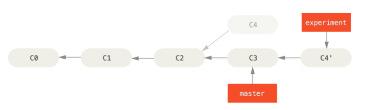
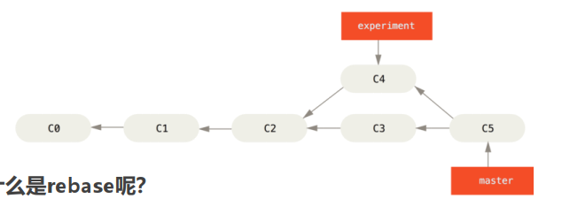

# 版本管理Git

### 1. 文件区域划分

#### 1.1 工作区 

#### 1.2 暂存区

```shell
 git add
```

#### 1.3 本地版本仓库

```shell
 git commit -m
```

#### 1.4 远程版本仓库

建立本地和远程的连接

```shell
git remote add origin url
```

git clone 默认已经关联分支

```shell
git clone url
```

设置上游分支，建立本地分支和远程分支的连接

```shell
git branch --set-upstream-to=origin/main
```

从远程main分支拉取代码到本地main分支， 等价于git fetch origin main + git merge origin/main

远程分支origin main 拉取到本地后为origin/main

```shell
git pull origin main
```

本地main分支和远程main分支建立连接，并将代码推送到远程main分支

```shell
git push -u origin main
```

git push 默认行为 本地分支和远程分支名称匹配的分支 eg：main origin/main

upstream： 推送到绑定的上游分支

current：推送到远程名称匹配的分支，如果分支不存在则创建

```shell
git config push.default simple
```

### 2. 忽略文件 .gitignore

https://github.com/github/gitignore

### 3. git修改历史提交信息

1. 指定修改第几次提交，会重新生成提交hash值和提交时间，即重新提交

```shell
git rebase -i HEAD~n //用于对最近的 n 次提交进行重新排序、修改、合并等操作
```

2. 修改pick commit message为edit commit message，指定修改该次提交
3. 执行修改最近一次的提交

```shell
git commit --amend
```

4. 执行变基让git应用修改

```shell
git rebase --continue
```

5. 强制推送

```shell
git push --force
```

### 4. git原理

文件组织结构：哈希前两位为目录名，后面值为文件名

#### 4.1 git add 原理

为每个文件创建文件哈希并保存

#### 4.2 git commit原理

1. 创建目录树哈希文件：保存暂存区所有文件的目录树结构对应哈希值，以便于查找
2. 创建commit对象：保存目录树哈希，提交信息，以及上一次提交的指针


### 5. git分支和标签

git分支和标签以及HEAD本质都是指针，指向某次的提交对象

改变分支即改变HEAD指针指向

### 6. git rebase和git merge

git rebase将一个分支的所有提交变基到另一个分支的提交之后

1. 找到两个分支的公共祖先
2.  将该分支的提交依次应用于该祖先的提交之后



git rebase发生冲突，解决冲突之后使用git rebase --continue

```shell
# rebase流程，一般不在主分支上rebase，在dev分支上rebase之后，再切换到main分支合并dev
git checkout dev
git rebase main
git checkout main
git merge dev
```

git merge将两个分支的提交合并为一个新的提交

1. 找到两个分支的公共祖先
2. 将两个分支提交所应用的修改合并，并生成一个新的提交



git pull --rebase所执行的流程

1. git fetch 拿下远程分支 origin/main
2. git rebase origin/main 将本地main分支的提交变基到远程main分支

### Git Flow

1. **master**作为主分支
2. **develop**作为开发分支，当有稳定版本时合并到master
3. **topic**作为专门开发某一个功能或者特性的分支，完成后合并到develop分支


1. **master**作为主分支，迭代的所有版本合并到master之后打上标签
2. **hotfix**分支，某一版本出现bug时，创建hotfix分支修复，同时合并到master和develop分支
3. **develop**作为开发分支，当有稳定版本时合并到release分支
4. **feature**作为专门开发某一个功能或者特性的分支，完成后合并到develop分支
5. **release**确定好代码发布的版本之后，同时合并到master和develop分支


